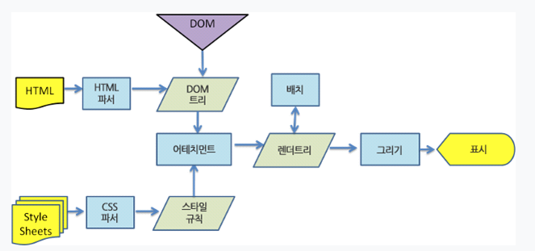

# 브라우저와 동작원리
## 브라우저 주요 기능
 브라우저의 주요 기능은 사용자가 선택한 자원을 서버에 요청하고 브라우저에 표시하는것이다. 자원은 보통 HTML 문서지만 PDF나 이미지 또는 다른 형태일 수 있다. 자원의 주소는 <a href="https://ko.wikipedia.org/wiki/%ED%86%B5%ED%95%A9_%EC%9E%90%EC%9B%90_%EC%8B%9D%EB%B3%84%EC%9E%90">URI</a>에 의해 정해진다. 브라우저는 웹 표준화 기구인 W3C(World Wide Web Consortium)에서 정한 명세에 따라 파일을 해석해서 표시한다.


 브라우저의 사용자 인터페이스는 브라우저 마다 서로 닮아 있는데 다음과 같은 요소들이 일반적이다.
> - URI를 입력할 수 이는 주소 표시 줄
> - 이전 버튼과 다음 버튼
> - 북마크
> - 새로 고침 버튼과 현재 문서의 로드를 중단 할 수 있는 정지 버튼
> - 홈버튼

## 브라우저의 구성요소
 1. 사용자 인터페이스
 2. 브라우저 엔진 : 사용자 인터페이스와 렌더링 엔진 사이의 동작을 제어.
 3. <strong>[렌더링 엔진](#렌더링-엔진)</strong> : 요청한 콘텐츠를 표시
 4. 통신 : HTTP 요청과 같은 네트워크 호출
 5. UI 백엔드 : OS 사용자 인터페이스 체계를 사용.
 6. 자바스크립트 해석기
 7. 자료저장소
<hr>

## 렌더링 엔진
사용자가 요청한 내용을 서버로부터 받아 브라우저 화면에 표시하는 역할을 한다.
(1) 표시할 수 있는 것 : HTML 및 XML 문서 그리고 이미지를 표시할 수 있음
(2) 확장 : 플러그인이나 브라우저마다 확장 기능을 이용해 PDF와 같은 유형도 표시할 수 있음
(3) 종류 : 사파리, 크롬 웹킷(Webkit)엔진,게코(Gecko)엔진
(4) 동작원리
기본적인 동작 과정
```HTML 문서를 파싱``` > ```브라우저 화면에 랜더링하기위해 다루기 쉬운 구조로 바꿈``` > ```CSS 파일파싱``` > ```렌더트리 구축``` > ```렌더트리 배치``` > ```렌더트리 그리기```

> 웹 킷 동작과정
> 