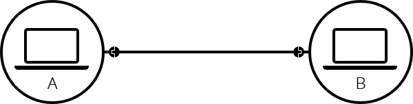
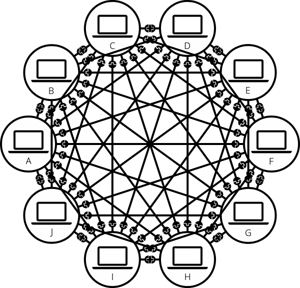
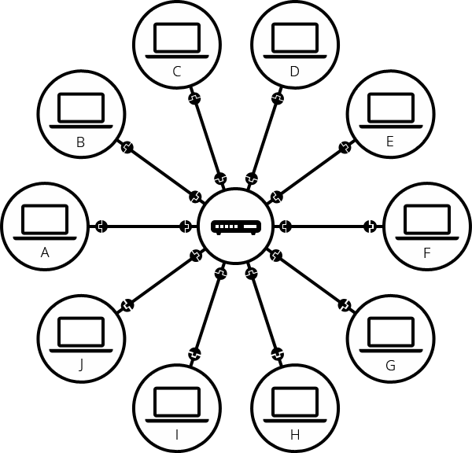

## 🎫인터넷이란?
> 정보를 담고 있는 각 컴퓨터들의 TCP/IP 라는 통신 프로토콜을 이용해 서로 정보를 주고받도록 한 컴퓨터 네트워크를 말한다.

## 🔮 인터넷에 대한 여러 사실

- TCP/IP 를 적립한 사람들이 '네트워크의 네트워크'를 구현하여, 모든 컴퓨터를 하나의 통신망에 연결(International Network) 하고자 하는 의도에서 이를 줄여 Internet 이라 명명했다.

- 컴퓨터가 ```서버``` 와 ```클라이언트``` 로 연결되어 TCP/IP를 이용해 정보를 주고 받게 되었다.

## 1) 단순한 네트워크
1. 1:1 연결   
두 대의 컴퓨터가 통신이 필요할 때, 우리는 다른 컴퓨터와 물리적으로(보통 이더넷 케이블, 일반적으로 우리가 말하는 '랜선') 또는 무선으로 (WIFI or Bluetooth) 연결되어야 한다.
모든 현대 컴퓨터들은 이러한 연결 중 하나를 이용하여 연결해야만 통신 할 수 있다.


2. N:N연결   
앞서 말했듯이 네트워크 연결은 2대의 컴퓨터로 제한되지 않는다. 이와 같은 방식으로 원하는 만큼 컴퓨터를 연결할 수 있다. 하지만 이렇게 계속해서 연결할 경우 빠르게 복잡성이 늘어난다.   


3. 라우터 연결   
위의 문제를 해결하기 위해 사용하는 것이 ```라우터(Router)``` 이다. 이는 특수한 소형 컴퓨터인데, 단 하나의 업만을 수행한다. 컴퓨터가 A가 B 로 메세지를 보내려면,  A는 메세지를 ```라우터```로 보내고, 라우터는 메세지를 B에게 보내도록 하고 C에게 보내지 않도록 한다.


(참고 : https://tcpschool.com/webbasic/intro)
