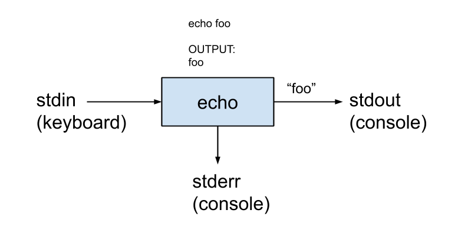

# POSIX(Portable Operating System Interface)

> 이식 가능 운영 체제 인터페이스의 약자로, 서로 다른 UNIX OS의 공통 API를 정리하여 이식성이 높은 유닉스 응용 프로그램을 개발하기 위한 목적으로 IEEE가 책정한 애플리케이션 인터페이스 규격이다.

- POSIX를 풀어서 설명하자면 한 운영체제에서 개발한 프로그램을 다른 운영체제에서도 쉽게 돌아가도록 하는 표준이라고 한다.(소스코드의 호환)

## <strong>표준 스트림</strong>
> 특정한 프로그래밍 언어 인터페이스뿐 아니라 유닉스 및 유닉스 계열 운영 체제(어느 정도까지는 윈도에도 해당함)에서 컴퓨터 프로그램과 그 환경(일반적으로 단말기) 사이에 미리 연결된 입출력 통로를 가리킨다.

- 표준 스트림에는 표준입력(stdin), 표준 출력(stdout), 표준 오류(stderr)가 있다. 그리고 이들은 POSIX에 들어있다.

<hr>

## <strong> 표준 스트림의 사용</strong>
터미널에서 이러한 명령어를 사용했다고 가정을했을때

``` 
echo foo 
```
```echo```는 다음 나오는 문자열을 터미널에 출력하는 명령어이다. 그렇다면 아래 그림과 같은 동작이 일어난다.



stdin으로 입력을 받아 echo에 넘겨준다. echo에서 stderr에 데이터를 저장하고 stdout에서 데이터를 출력한다.