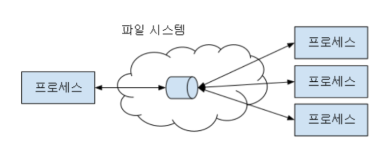
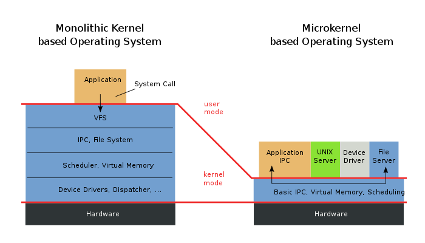

# 프로세스간 통신(IPC)
> 프로세스들 사이에 서로 데이터를 주고받는 행위 또는 그에 대한 방법이나 경로를 뜻한다. IPC는 마이크로커널과 나노커널의 디자인 프로세스에 매우 중요하다. 마이크로커널은 커널이 제공하는 기능의 수를 줄여준다.

- 프로세스가 통신이 가능하다는 것은 다른 프로세스가 데이터를 주고 받을 수 있다는 뜻인데, 이때 필요한 것이 동시에 접근가능한 메모리 즉, ```프로세스들이 공유하는 메모리```가 필요하다.

## 프로세스간 통신을 위한 메모리할당 기술

## <strong>파이프(PIPE)</strong>
> 유닉스 계열 운영 체제에서 제공되는 병행성 메커니즘의 하나로서, 두 프로세스가 생산자-소비자 모델에 따라 통신할 수 있게 해주는 원형 버퍼이다. 즉, 파이프는 한 프로세스가 쓰고 다른 프로세스가 읽는 선입선출 형태의 큐라 할 수 있다.

## <strong>Unix Domain Socket</strong>
> Unix 도메인 소켓 또는 IPC 소켓은 동일한 호스트 운영 체제에서 실행되는 프로세스간에 데이터를 교환하기위한 데이터 통신 엔드 포인트이다.



- 서버/클라이언트 환경을 구축하는데 용이
- 중대형 애플리케이션에서 주로 사용

## <strong>공유 메모리(Shared Memory)</strong>
> 컴퓨터 환경에서 여러 프로그램이 동시에 접근할 수 있는 메모리이다. 과다한 복사를 피하거나 해당 프로그램 간 통신을 위해 고안되었다. 환경에 따라 프로그램은 하나의 프로세서에서나 여러 개의 프로세서에서 실행할 수 있다.

- 대량의 정보를 다수의 프로세스에게 배포 가능
- 빠르고 효율적
- 공유 메모리 공간에 대한 접근 제어가 필요

## <strong>마이크로 커널</strong>

> 컴퓨터 과학에서 운영 체제에 추가되어야 하는 메커니즘을 최소한으로 제공하는 초소형 커널이다. 이러한 미니멀리티 메커니즘에는 낮은 수준의 주소 공간 관리, 스레드 관리, 프로세스 간 통신을 포함한다.



## <strong>나노커널</strong>
> 하드웨어 추상화를 제공하지만 시스템 서비스는 제공하지 않는 작은 커널이다. 더 큰 커널은 더 많은 기능을 제공하고 더 많은 하드웨어 추상화를 관리하도록 설계된다. 현대의 마이크로커널은 시스템 서비스도 부족하다. 따라서 마이크로커널과 나노커널이라는 용어는 유사해졌다.