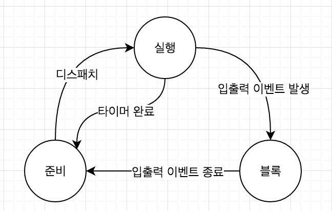

# Process_Management
## 프로세스란?

> 프로세스는 컴퓨터에서 연속적으로 실행되고 있는 컴퓨터 프로그램을 말한다. 종종 스케줄링의 대상이 되는 작업이라는 용어와 거의 같은 의미로 쓰인다. 여러 개의 프로세서를 사용하는 것은 멀티프로세싱이라고 하며 같은 시간에 여러 개의 프로그램을 띄우는 시분할 방식을 멀티태스킹이라고 한다.

## 프로세스 관리가 필요한 이유?

- 컴퓨터는 한번에 하나의 프로세스를 처리할 수 있다. 하지만 우리는 하나의 프로그램을 전부 처리할 때까지 기다려야 한다면 얼마나 답답하겠는가?
> 그래서 프로세스 관리를 통해 <strong>마치 여러가지 프로그램을 동시에 실행하는 것 처럼</strong> 만들 필요가 있다.
- 이것이 가능한 이유는 OS가 아주 짧은 시간내에 CPU가 실행할 프로세스를 전환할 수 있기 때문이다.

## 프로세스의 관리의 동작

- 운영체제는 프로세스의 상태를 실행(running), 준비(ready), 블록(block) 상태로 분류하고 프로세스들을 상태전이(state transition)를 통해 체계적으로 관리한다.

> 1. 사용자가 프로그램을 실행하면 프로세스가 생성되고 준비리스트에 추가된다.
> 2. 프로세스는 프로세서(CPU)가 사용가능한 상태가 되면 CPU를 할당받는다. (이를 준비상태에서 실행상태로 상태전이(state transition)를 통해 체계적으로 관리한다.)
> 3. 그 다음 프로세스는 실행상태에서 CPU를 이용해 연산한 후 CPU를 자발적으로 반납하고 작업이 끝나지 않았으면 다시 준비상태에 들어간다. 운영체제는 다시 준비 리스트의 첫번째에 있는 프로세스를 실행상태로 바꾸고 이 과정을 반복한다.

- 이 1,2 과정을 <strong>디스패칭(dispatching)</strong>이라고 하고 <strong>디스패처(dispatcher)</strong>가 이 일을 수행한다.

