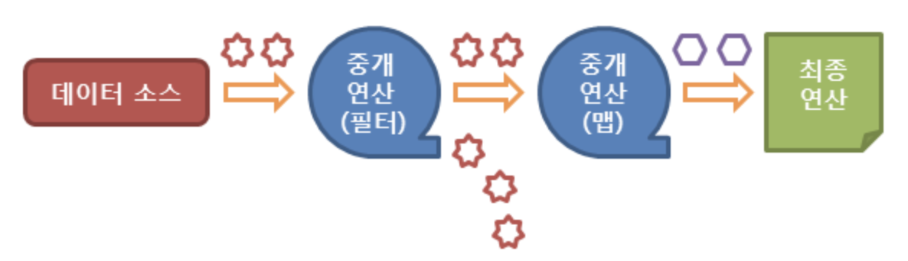

# Stream
> Stream은 Java SE 8 부터 추가된 자바의 많은 양의 데이터(배열,컬렉션 등)을 접근하기위해 생긴 API 이다.

### 스트림 API 특징
1. 스트림은 외부 반복을 통해 작업하는 컬렉션과는 달리 내부 반복(internal iteration)을 통해 작업을 수행한다.
2. 스트림은 재사용이 가능한 컬렉션과는 달리 **단 한번만 사용**할 수 있다.
3. 스트림은 **원본 데이터를 변경하지 않는다.**
4. 스트림의 연산은 필터-맵(filter-map) 기반의 API를 사용하여 지연(lazy) 연산을 통해 성능을 최적화합니다.
5. 스트림은 parallelStream() 메소드를 통한 손쉬운 병렬 처리를 지원한다.

### 스트림 API의 동작 흐름

1. 스트림의 생성
2. 스트림의 중개 연산 (스트림의 변환)
3. 스트림의 최종 연산 (스트림의 사용)

> 다음 그림은 자바 스트림 API가 동작하는 흐름을 나타낸다.


### 스트림의 생성
스트림 API는 다음과 같은 **다양한 데이터 소스**에서 생성할 수 있다.
1. 컬렉션
2. 배열
3. 가변 매개변수
4. 지정된 범위의 연속된 정수
5. 특정 타입의 난수들
6. 람다 표현식
7. 파일
8. 빈 스트림

### 컬렉션
자바에서 제공하는 모든 컬렉션의 최고 상위 조상인 Collection 인터페이스에는 Stream() 메소드가 정의되어 있다. 따라서 Collection 인터페이스를 구현한 모든 List와 Set 컬렉션 클래스에도 Stream() 메소드로 스트림을 생성할 수 있다.

```java
import java.util.*;
import java.util.stream.*;

public class prog {
	public static void main(String[] args){
		ArrayList<Integer> list = new ArrayList<Integer>();
		
		list.add(4);
		list.add(2);
		list.add(3);
		list.add(1);
		
		// 컬렉션에서 스트림 생성
		Stream<Integer> stream = list.stream();
		// forEach() 메소드를 이용한 스트림 요소의 순차 접근
		stream.forEach(System.out::println);		
	}
}
```
> 실행결과   
> 4   
> 3   
> 2   
> 1   

### 배열
```
String[] arr = new String[]{"넷","둘","하나"}

// 배열에서 스트림 생성

Stream<String> stream1 = Arrays.stream(arr);
stream1.forEach(e -> System.out.print(e + " "));
System.out.println();

// 배열의 특정 부분만을 이용한 스트림 생성
Stream<String> stream2 = Arrays.stream(arr, 1, 3);
stream2.forEach(e -> System.out.print(e + " "));
```