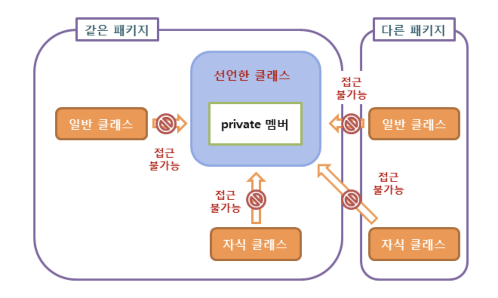
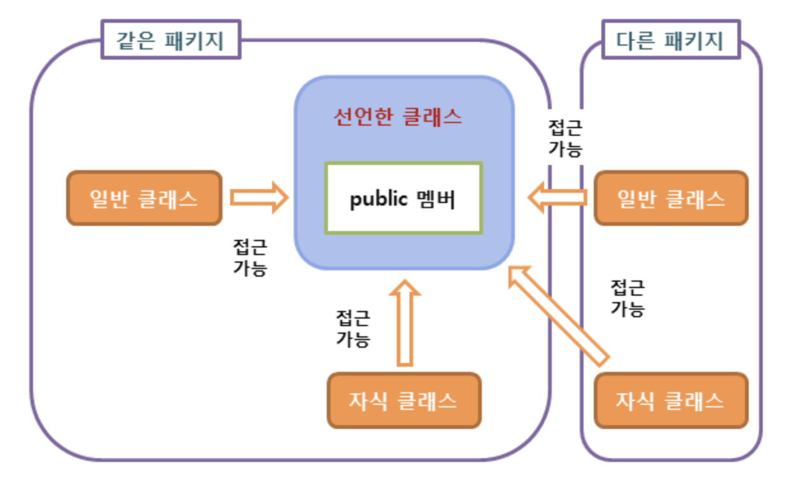
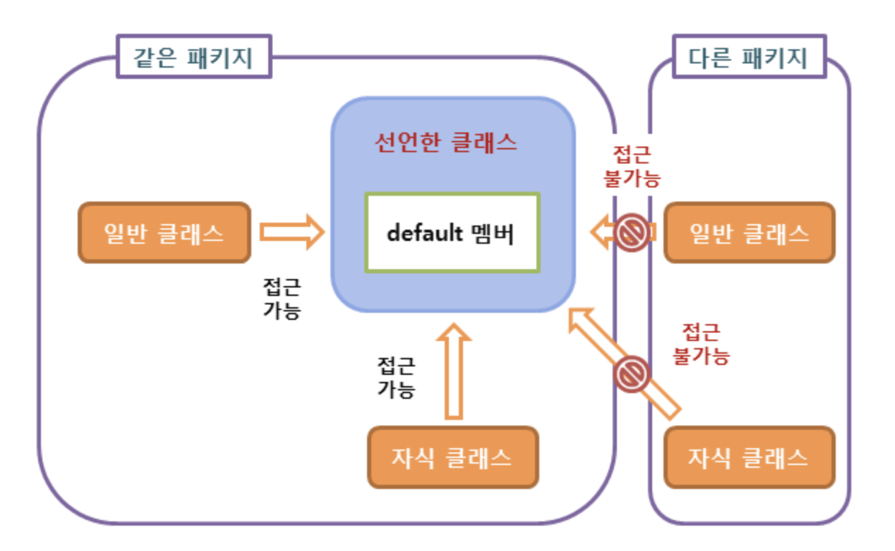
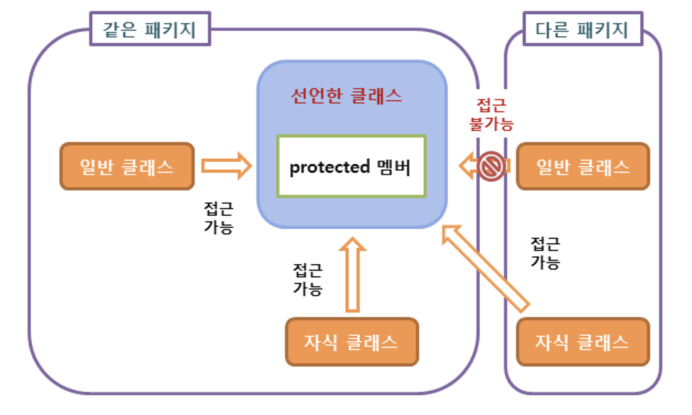

# 접근 제어자
### 제어자(modifier)
클래스와 클래스 멤버의 선언 시 사용하여 부가적인 의미를 부여하는 키워드를 의미한다.   
자바에서 제어자는 접근 제어자(access modifier)와 기타 제어자로 구분할 수 있다.

```
여기서 잠깐, 멤버(member)란?
인스턴스가 가지고 있는 필드(Field) 및 메소드(Method)를 의미 하며 이들은 인스턴스 필드, 인스턴스 메소드 라고 불린다.
```

### 접근 제어자 (access modifier)
객체 지향에서 정보 은닉(data hiding)이란 사용자가 굳이 알 필요가 없는 정보는 사용자로부터 숨겨야 한다는 개념이다.  
그렇게 함으로써 사용자는 언제나 최소한의 정보만으로 프로그램을 손쉽게 사용할 수 있게 된다.

자바에서는 다음과 같은 네 가지의 접근 제어자를 제공한다.

```
1. private
2. public
3. default
4. protected
```

### private 접근 제어자
private 접근 제어자를 사용하여 선언된 클래스 멤버는 외부에 공개되지 않으며, **외부에서는 직접 접근할 수 없다.**   
즉, 자바 프로그램은 private 멤버에 직접 접근할 수 없으며, 해당 객체의 public 메소드를 통해서만 접근할 수 있다.  
따라서 private 멤버는 public 인터페이스를 직접 구성하지 않고, 클래스 내부의 세부적인 동작을 구현하는 데 사용된다.



```
예)
public class SameClass {
    private String var = "같은 클래스만 허용"; // private 필드

    private String getVar() {           // private 메소드
        return this.var;
    }
}
```

### public 접근 제어자
public 접근 제어자를 사용하여 선언된 클래스 멤버는 외부로 공개되며, 해당 객체를 사용하는 프로그램 어디에서나 직접 접근할 수 있다.

자바 프로그램은 public 메소드를 통해서만 해당 객체의 private 멤버에 접근할 수 있다.

따라서 public 메소드는 private 멤버와 프로그램 사이의 인터페이스(interface) 역할을 수행한다고 할 수 있다.



```
예)
public class Everywhere {
    public String var = "누구든지 허용"; // public 필드

    public String getVar() {             // public 메소드
        return this.var;
    }
}
```


### default 접근 제어
자바에서는 클래스 및 클래스 멤버의 접근 제어의 기본값으로 default 접근 제어를 별도로 명시하고 있다.

이러한 default를 위한 접근 제어자는 따로 존재하지 않으며, 접근 제어자가 지정되지 않으면 자동적으로 default 접근 제어를 가지게 된다.

default 접근 제어를 가지는 멤버는 같은 클래스의 멤버와 같은 패키지에 속하는 멤버에서만 접근할 수 있다.

다음 그림은 클래스의 default 멤버에 접근할 수 있는 영역을 보여준다.



### protected 접근 제어
자바 클래스는 private 멤버로 정보를 은닉하고, public 멤버로 사용자나 프로그램과의 인터페이스를 구축한다.   
여기에 부모 클래스(parent class)와 관련된 접근 제어자가 하나 더 존재한다.   
protected 멤버는 부모 클래스에 대해서는 public 멤버처럼 취급되며, 외부에서는 private 멤버처럼 취급된다.   
클래스의 protected 멤버에 접근할 수 있는 영역은 다음과 같다.
1. 이 멤버를 선언한 클래스의 멤버

2. 이 멤버를 선언한 클래스가 속한 패키지의 멤버

3. 이 멤버를 선언한 클래스를 상속받은 자식 클래스(child class)의 멤버

다음 그림은 클래스의 protected 멤버에 접근할 수 있는 영역을 보여줍니다.

