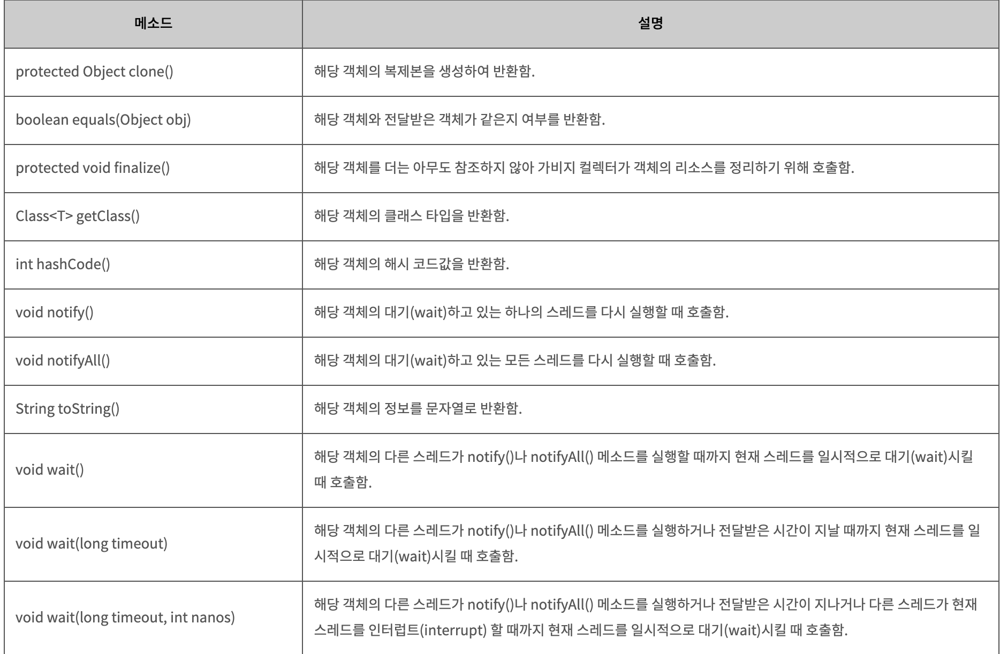

### Object 클래스

### java.lang package
java.lang 패키지는 가장 기본적인 동작을 수행하는 클래스들의 집합이다.    
따라서 자바에서는 java.lang 패키지의 클래스들은 import 문을 사용하지 않아도 클래스 이름만으로 바로 사용할 수 있게 하고 있다.

### java.lang.Object 클래스
java.lang 패키지 중에서도 가장 많이 사용되는 클래스는 바로 Object 클래스입니다.
Object 클래스는 **모든 자바 클래스의 최고 조상 클래스**가 된다.
따라서 자바의 모든 클래스는 Object 클래스의 모든 메소드를 바로 사용할 수 있다.

이러한 **Object 클래스는 필드를 가지지 않으며, 총 11개의 메소드만**으로 구성되어 있다.

### Object 클래스 메소드 목록
