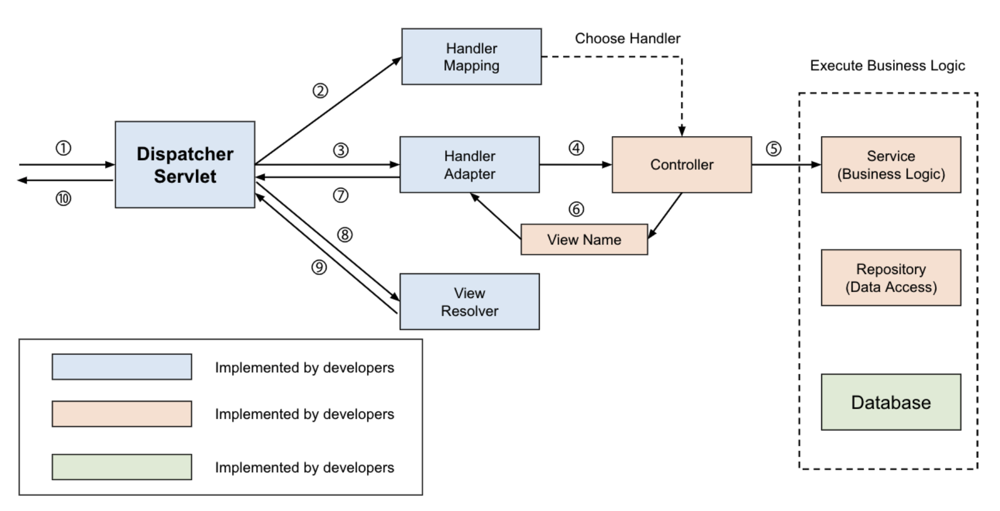
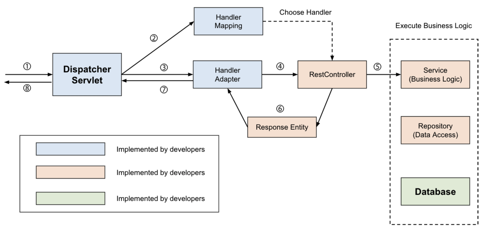

### @Controller 와 @RestController 의 차이점
@Controller 와 @RestController 의 차이를 간단히 정의하자면,   
`@Controller` 는 **View 를 반환해주는 전통적인 Spring MVC 에서 사용**이 되고,   
`@RestController` 는 **RESTFul 한 웹서비스에서 사용**이 된다.

### @Controller 에서 View 반환하기
전통적인 Spring MVC의 컨트롤러인 @Controller는 주로 View를 반환하기 위해 사용한다.    
아래와 같은 과정을 통해 Spring MVC Container는 Client의 요청으로부터 View를 반환한다.

> 스프링 MVC 에서 View 를 반환하는 과정
> 
> 1. Client는 URI 형식으로 웹 서비스에 요청을 보낸다.
> 2. DispatcherServlet이 요청을 위임할 HandlerMapping을 찾는다.
> 3. HandlerMapping을 통해 요청을 Controller로 위임한다.
> 4. Controller는 요청을 처리한 후에 ViewName을 반환한다.
> 5. DispatcherServlet은 ViewResolver를 통해 ViewName에 해당하는 View를 찾아 사용자에게 반환한다.

### @Controller 에서 Data 반환하기 ( Spring MVC 에서도 Data 반환하기 )
Spring MVC의 컨트롤러를 사용하면서 Data를 반환해야 하는 경우도 있다.   
컨트롤러에서는 데이터를 반환하기 위해 `@ResponseBody 어노테이션`을 활용해주어야 한다.  
이를 통해 Controller도 `Json 형태`로 데이터를 반환할 수 있다.
> 스프링 MVC 에서 Data 를 반환하는 과정
> 
> 1. Client는 URI 형식으로 웹 서비스에 요청을 보낸다.
> 2. DispatcherServlet이 요청을 위임할 HandlerMapping을 찾는다.
> 3. HandlerMapping을 통해 요청을 Controller로 위임한다.
> 4. Controller는 요청을 처리한 후에 객체를 반환한다.
> 5. 반환되는 객체는 Json으로 Serialize되어 사용자에게 반환된다. 

### @RestController
@RestController는 `@Controller`에 `@ResponseBody`가 추가된 것이다.    
당연하게도 RestController의 주용도는 `Json 형태로 객체 데이터를 반환`하는 것이다.    
최근에 데이터를 응답으로 제공하는 REST API를 개발할 때 주로 사용하며 객체를 `ResponseEntity(Spring 에서 지원하는 Response 할때 사용하는 Entity)`로 감싸서 반환한다.   
이러한 이유로 동작 과정 역시 **@Controller에 @ReponseBody를 붙인 것과 완벽히 동일**하다.

> @RestContorller 를 사용할때
> 
> 1. Client는 URI 형식으로 웹 서비스에 요청을 보낸다.
> 2. DispatcherServlet이 요청을 위임할 HandlerMapping을 찾는다.
> 3. HandlerMapping을 통해 요청을 Controller로 위임한다.
> 4. Controller는 요청을 처리한 후에 객체를 반환한다.
> 5. 반환되는 객체는 Json으로 Serialize되어 사용자에게 반환된다.