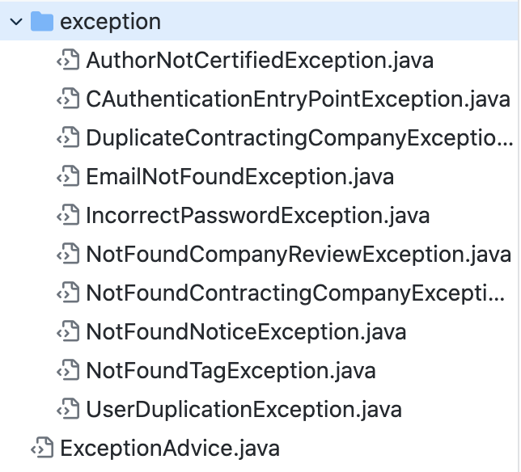
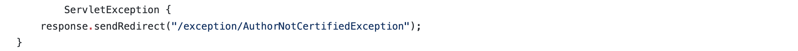

# 상현 사마 프로젝트 염탐
### java/com/gsm/chwijuntime
### advice/exception   
advice : 실질적으로 어떤 일을 해야할 지에 대한 것, 실질적인 부가기능을 담은 구현체  
exception : 연결 오류가 생겼을때 브레이크해주는 클래스들

특이점 ) 모든 클래스들이 Runtimeexception을 상속받고있는데 이 클래스(모듈)는 이 모듈은 클래스에서 맞는 상황이 나왔을때 브레이크를 해주는 역할을 한다.

결론 : advice/exception 패키지는 예외처리(에러처리)를 해주는 패키지 이다.



### config   
config : 구성

### controller/exception   
접속할때 오류가생기면 처리해주는 역할을 한다.   

결론 : Controller는 사용자(Client)의 요청(Request)을 어떻게 처리 할 지(Handling) 결정하는 것이다.
```   
UI로부터 사용자 input(요청)을 받아서,   
어떤 service layer api를 호출에서 결과를 가져올지 결정하고,   
어떤 UI(ex,jsp page)에 그 결과를 전달할지 결정한다.
```

### DTO   
계층간 데이터 교환을 위한 JAVA bins
여기서 말하는 계층은 Controller, View, Business Layer, Persistent Layer를 말하며 각 계층간 데이터 교환을 위한 객체를 DTO 또는 VO라고 부른다.
```
private 변수
생성자
getter/ setter
toString
```
필드와 메소드로 주로 구성이 되어있다.

결론 : 상현이 형의 DTO폴더 같은 경우에는 각각 기능별마다 사용되는 데이터 전송 객체들을 모아두었다.    
   

### handler
특징 : 핸들러 폴더에있는 파일들은 모두 ServletException 이라는 문법이 있다(뭐라부르는지는 모르겠음)   

- 하는 기능은 아마도 서블릿(클라이언트에서 리퀘스트 를 보냈을때 그 결과를 반환하는 자바 웹프로그래밍 기술)을 처리하는 과정에서 오류가 발생했을때 예외 처리해주는 기능 같다.

### model
model 폴더는 주로 데이터베이스를 매핑시켜주는 기능을 한다.