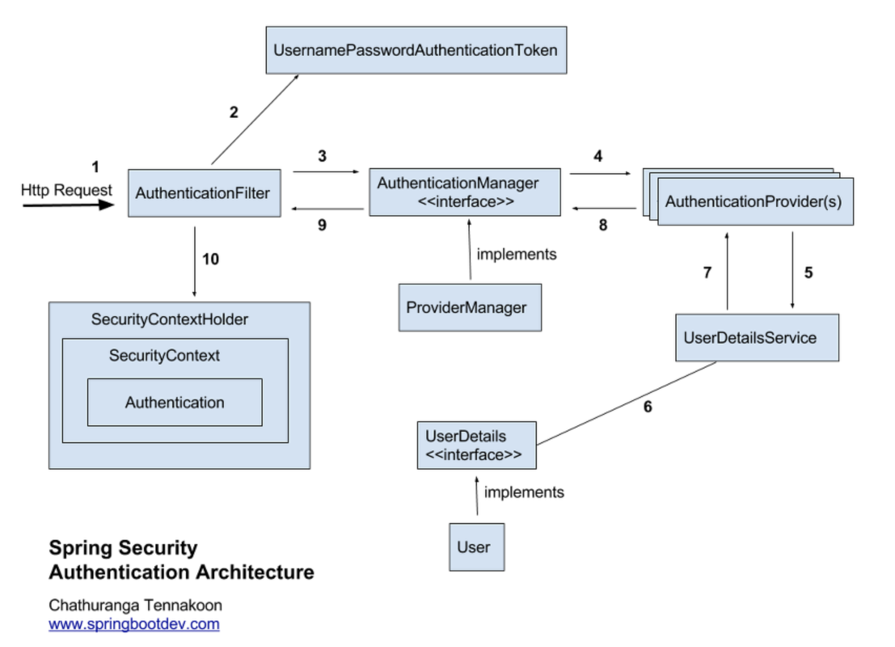

# Spring Security
> Spring Security 개념을 정리한 마크다운

### 인증(Authentication)과 권한(Authorization)


- 인증(Authentication)   
보호된 리소스에 접근하는 대상, 즉 사용자에게 적절한 접근 권한이 있는지 확인하는 일련의 과정을 의미

이때, 보호된 리소스에 접근하려는 대상(사용자)를 **접근 주체** 라고 부른다.

- 권한(Authorization)
인증 절차가 끝난 후 접근 주체가 보호된 리소스에 접근이 가능한지 결정하는 것을 의미,

이때, 권한을 부여하는 작업을 **인가**라고 한다.

## 스프링 시큐리티 구조



```
Authentication : 입증, 인증
Provider : 제공자
```
위 그림의 동작 플로우
1. 사용자가 로그인 정보를 함께 인증 요청(Http Request)
2. **AuthenticationFilter**가 이 요청을 가로챔. 이때 가로챈 정보를 통해 **UsernamePasswordAuthenticationToken**(이하, 토큰 객체) 이라는 인증용 객체를 생성
3. **AuthenticationManager**의 구현체인 **ProviderManager**에게 토큰 객체를 전달
4. 다시 **AuthenticationProvider**에 토큰 객체를 전달
5. 실제 데이터베이스에서 사용자 인증정보를 가져오는 **UserDetailsService**에 사용자 정보(아이디)를 전달
6. 넘겨받은 사용자 정보를 통해 DB에서 찾은 사용자 정보인 **UserDetails** 객체를 생성
7. **AuthenticationProvider**는 **UserDetails**를 넘겨받고 사용자 정보를 비교
8. 인증이 완료되면 권한 등의 사용자 정보를 담은 **Authentication** 객체를 반환
9. 다시 최초의 **AuthenticationFilter**에 **Authentication** 객체가 반환
10. **Authentication** 객체를 **SecurityContext**에 저장

