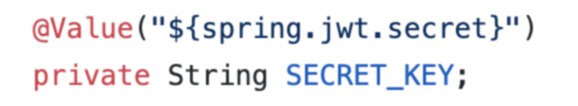
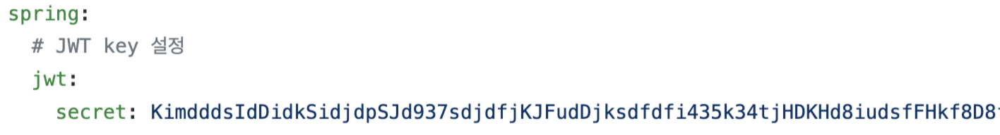

# Spring_Security

@Value : key.yml(설정파일) 에 미리 key값을 명시해두고 어노테이션을 활용하여 값을 사용한다.


ex) key.yml

---

```java
    private Key getSigningKey(String secretKey) {
        byte[] keyBytes = secretKey.getBytes(StandardCharsets.UTF_8);
        return Keys.hmacShaKeyFor(keyBytes);
    }
```

secretKey 파라미터에 위에 선언한 SECRET_KEY를 삽입하여 키를 UTF-8로 인코딩

---
```java
   public Claims extractAllClaims(String token) throws ExpiredJwtException {
        return Jwts.parserBuilder()
                .setSigningKey(getSigningKey(SECRET_KEY))
                .build()
                .parseClaimsJws(token)
                .getBody();
    }
```

Claim에 정보를 넣는 메소드

```
클레임이란?
-> JWT Header.Payload.Signature 중 Payload 에 토큰에서 사용할 정보의 조각들로 사용이 된다. Json(key/Value) 형태로 정보를 넣을 수 있다.
```
- 등록된 클레임(Registered Claim)   
등록된 클레임은 토큰 정보를 표현하기 위해 이미 정해진 종류의 데이터들로, 모두 선택적으로 작성이 가능하며 사용할 것을 권장한다.

---

디코딩 : 우리가 알아볼 수 있는 언어 (String) -> 기계어 (컴퓨터가 알아볼 수 있는 언어)   
인코딩 : 기계어 (컴퓨터가 알아볼 수 있는 언어) -> 우리가 알아볼 수 있는 언어 (String)