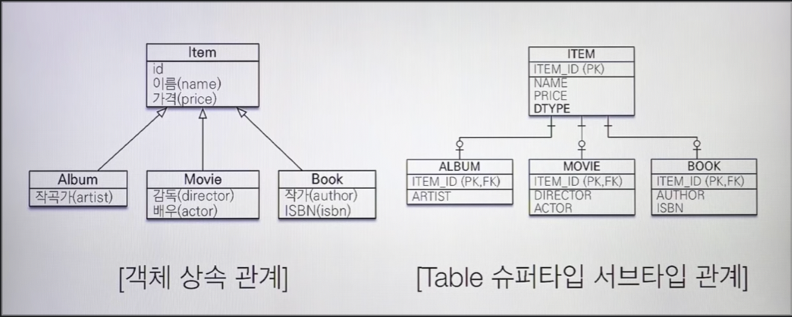
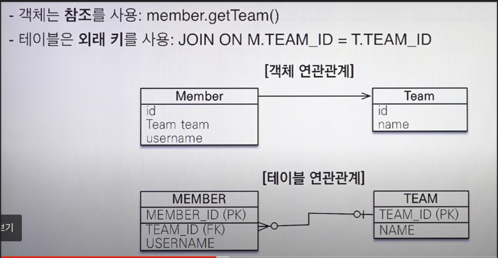
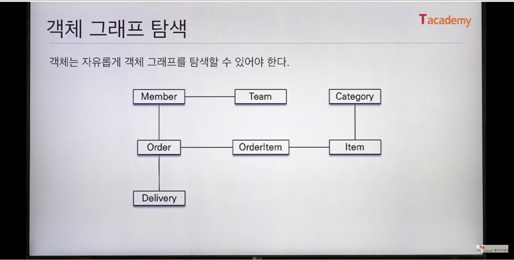
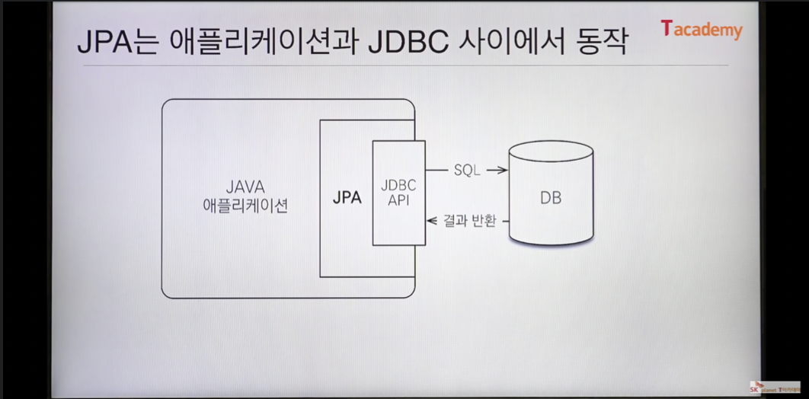
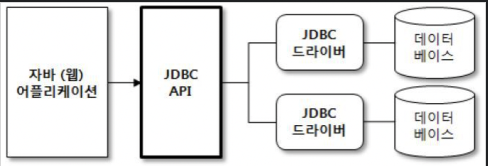
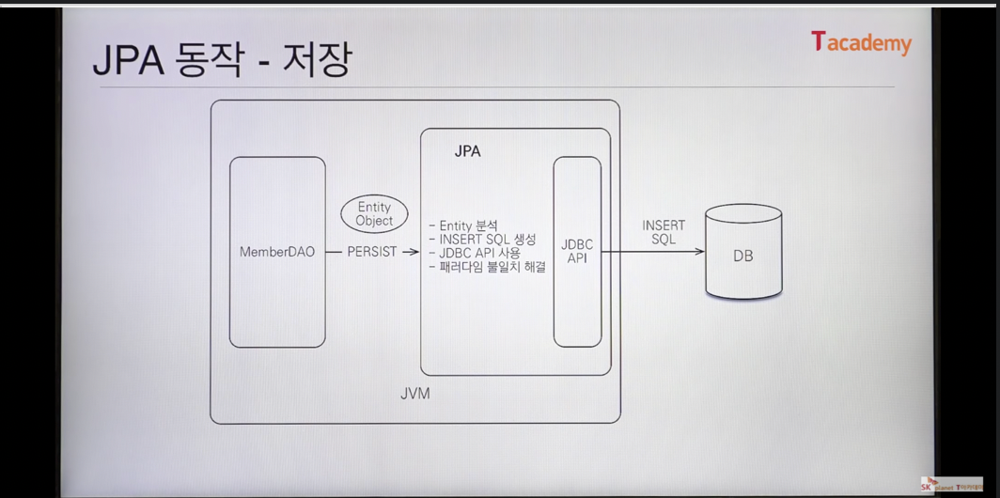

# Academy JPA 강의 [1강]
> (궁금점, H2 Database란?, 패러다임의 불일치란?)

### H2 DB
> H2DB는 자바 기반의 오픈소스 관계형 데이터 베이스 관리 시스템(RDBMS)
> 또한 브라우저 기반의 콘솔모드를 이용 가능
> SQL 문법은 다른 DBMS들과 마찬가지로 표준 SQL의 대부분이 지원
> 이러한 장점들 때문에 어플리케이션 개발 단계의 테스트 DB로서 많이 이용

### 패러다임의 불일치
> 데이터베이스는 데이터 중심으로 구조화되어있다.
> 객체의 상속, 다형성 같은 개념이 없다.
> 그렇다보니 객체와 데이터베이스가 지향하는 점이 다르다.
> *이것을 객체와 데이터베이스의 패러다임 불일치* 라고 한다.

### JPA를 사용하는 이유
- 데이터베이스의 세계의 모든것은 관계형 DB 이다.

### 패러다임의 불일치

### 개발자 == SQL 매퍼

### 관계형데이터베이스에는 상속관계가 있다?
- 정답 : 없다.

### DB에 저장할때에는 상속관계를 사용하지 않는다.

- 대신 슈퍼타입 서브타입 이라는 것을 사용

### 연관관계 

객체에대한 연관관계에는 방향성이 존재하여 Member에서 Team객체로 갈 수 있지만
Team에서 Member는 가지못한다.

하지만 테이블에대한 연관관계에서 ForiegnKey에는 방향성이 존재하지않아 Member에서 Team 자유자재로 갈 수 있다.

(나중에 이두차이를 몰라서 포기할 수 있으니 조심하자.. 하지만 이 두개의 차이만 안다면 쉬워지니 명심하자)

### 객체는 자유롭게 객체 그래프를 탐색할 수 있어야한다.

### 객체답게 모델링 할수록 매핑 작업만 늘어난다.

### 객체를 자바 컬렉션에 저장 하듯이 DB에 저장할 수는 없을까?

### JPA?
- Java Persistence API
- 자바 진영의 ORM 기술 표준

### ORM?
- Object-relational mapping(객체 관계 매핑)
- 객체는 객체대로 설계
- 관계형 데이터베이스는 관계형 데이터베이스대로 설계
- ORM 프레임워크가 중간에서 매핑
- 대중적인 언어에는 대부분 ORM 기술이 존재

> (궁금점, JDBC란?)
> 자바에서 DB 프로그래밍을 하기 위해 사용되는 *API*
> (데이터베이스 종류에 상관 X)

### JPA 사용 예시
JPA EX)

1. MemberDAO 에서 회원객체를 넘기면
2. Entity를 분석하여 Insert쿼리를 직접 작성하여
3. JDBC API를 이용하여 DB에 Insert
(여기서 엄청중요한 패러다임의 불일치를 해결해줌)

> (궁금점, 패러다임의 불일치란?)
> 데이터베이스는 데이터 중심으로 구조화되어있다.
> 객체의 상속, 다형성 같은 개념이 없다.
> 그렇다보니 객체와 데이터베이스가 지향하는 점이 다르다.
> *이것을 객체와 데이터베이스의 패러다임 불일치* 라고 한다.

가볍게말하자면 JPA가 쿼리문을 편하게 직접 만들어줌