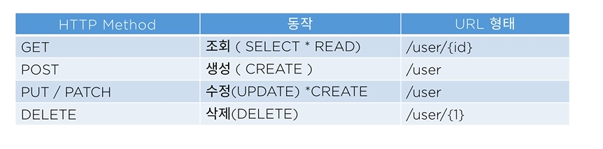

# Annotation

### @Configuration
- 어노테이션기반 "환경구성"을 돕는다. 주로 ```Cofnig``` 폴더에서 ```@Bean``` 어노테이션과 같이 사용함.

### @Bean
- Configuration 이 관리하는 어노테이션

### @RequiredArgsConstructor
- 이 어노테이션은 초기화 되지 않은 ```final``` 필드나, ```@NotNull``` 이 붙은 필드에 대해 생성자를 생성자를 생성해 준다. **주로 의존성 주입(Dependency Injection)** 편의성을 위해서 사용되곤 한다.

### @RequestMapping
```
@RestController //Controller 라는 것을 명시
@RequestMapping("/api") // localhost:8080/api 가 매칭
public class GetController {
 
    @RequestMapping(method = RequestMethod.GET, path = "/getMethod") //localhost:8080/api/getMethod
    public String getRequest(){
            return "Hi getMethod";
            //@RequestMaping인데 method를 설정해줌으로 주소 하위 메소드로 들어감
            //여기서 return 한 것이 웹에 띄워짐
            //요청이 들어오면 이 안으로 옴
    }
}
```   

### @GetMapping   
```
@GetMapping("/getParameter") //localhost:8080/api/getParameter?id=1234&password=abcd 물음표 뒤부터가 파라미터터
   public String getParameter(@RequestParam String id, @RequestParam String password){
 
        //만약에 여기서 password라는 변수가 쓰인다면 매개변수는 다른 이름으로 password를 받아야함.
        //그렇게 되면 매핑이 안되므로 @RequestParam(name = "password") pwd이렇게 해주면
        // 들어오는 인자는 password라는 이름으로 매핑될거야 라는 뜻.
        System.out.println("id :"+id);
        System.out.println("password :"+password);
 
        return id+password; //여기서 return 한 것들이 web에 띄워짐
 
    }
```

### @PostMapping
PostMapping 어노테이션은 주소창에 파라미터가 노출되지 않는다.



