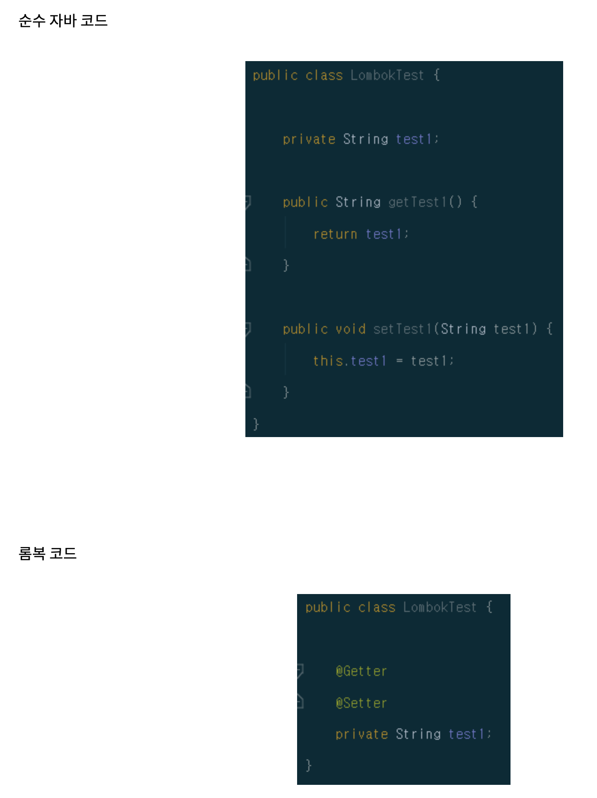
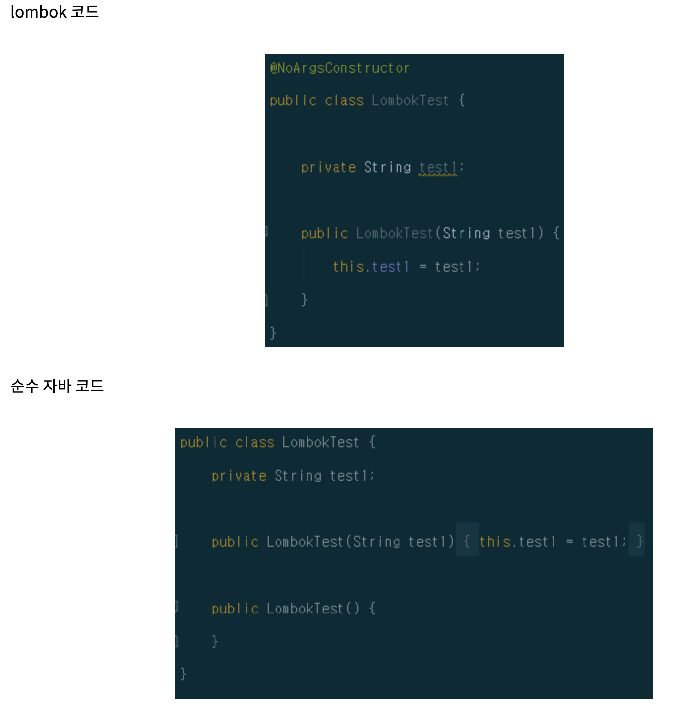
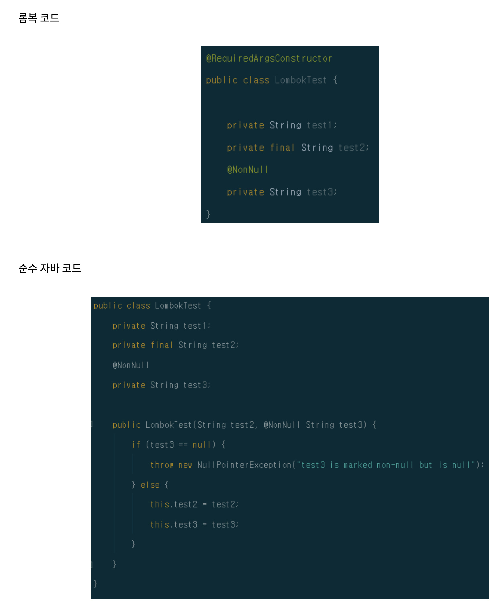
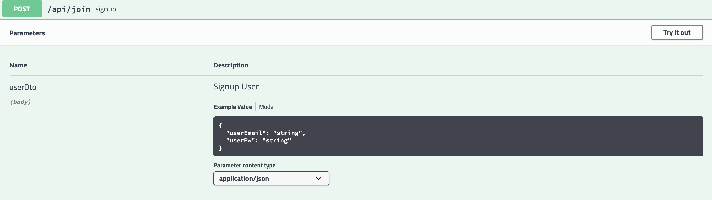

# Annotation

### @Configuration
- 어노테이션기반 "환경구성"을 돕는다. 주로 ```Cofnig``` 폴더에서 ```@Bean``` 어노테이션과 같이 사용함.

### @Bean
- Configuration 이 관리하는 어노테이션

### @RequiredArgsConstructor
- 이 어노테이션은 초기화 되지 않은 ```final``` 필드나, ```@NotNull``` 이 붙은 필드에 대해 생성자를 생성자를 생성해 준다. **주로 의존성 주입(Dependency Injection)** 편의성을 위해서 사용되곤 한다.

### @RequestMapping
```
@RestController //Controller 라는 것을 명시
@RequestMapping("/api") // localhost:8080/api 가 매칭
public class GetController {
 
    @RequestMapping(method = RequestMethod.GET, path = "/getMethod") //localhost:8080/api/getMethod
    public String getRequest(){
            return "Hi getMethod";
            //@RequestMaping인데 method를 설정해줌으로 주소 하위 메소드로 들어감
            //여기서 return 한 것이 웹에 띄워짐
            //요청이 들어오면 이 안으로 옴
    }
}
```   

### @GetMapping   
```
@GetMapping("/getParameter") //localhost:8080/api/getParameter?id=1234&password=abcd 물음표 뒤부터가 파라미터터
   public String getParameter(@RequestParam String id, @RequestParam String password){
 
        //만약에 여기서 password라는 변수가 쓰인다면 매개변수는 다른 이름으로 password를 받아야함.
        //그렇게 되면 매핑이 안되므로 @RequestParam(name = "password") pwd이렇게 해주면
        // 들어오는 인자는 password라는 이름으로 매핑될거야 라는 뜻.
        System.out.println("id :"+id);
        System.out.println("password :"+password);
 
        return id+password; //여기서 return 한 것들이 web에 띄워짐
 
    }
```

### @PostMapping
- PostMapping 어노테이션은 주소창에 파라미터가 노출되지 않는다.


## 롬복
### @Getter/@Setter
- 필드에 @Getter나 @Setter를 붙인다면, lombok이 해당 필드에 대한 기본 getter/setter를 생성해준다.



### @NoArgsConstructor/ @RequiredArgsConstructor/ @AllArgsConstructor

- 생성자를 자동으로 생성해주는 어노테이션들이다.

### @NoArgsConstructor
- 이 어노테이션은 "파라미터가 없는 생성자"를 생성한다.



```
@NoArgsContructor를 사용할 때 주의점

1. 필드들이 final로 생성되어 있는 경우에는 필드를 초기화 할 수 없기 때문에 생성자를 만들 수 없고 에러가 발생하게 된다.

이 때는 @NoArgsConstructor(force = true) 옵션을 이용해서 final 필드를 0, false, null 등으로 초기화를 강제로 시켜서 생성자를 만들 수 있다.

2. @NonNull 같이 필드에 제약조건이 설정되어 있는 경우, 생성자내 null-check 로직이 생성되지 않는다.

후에 초기화를 진행하기 전까지 null-check 로직이 발생하지 않는 점을 염두하고 코드를 개발해야 한다.
```

### @RequiredArgsConstructor
초기화 되지 않은 모든 final 필드, @NonNull로 마크돼있는 모든 필드들에 대한 생성자를 자동으로 생성해준다.



### @Entity
- JPA가 관리할 객체

### @Id
- DB PK와 매핑 할 필드

### GeneratedValue
- 자동으로 값을 증가시켜주는 어노테이션

### @Column
- 변수와 컬럼을 매핑하기위한 어노테이션

### @Table
- 클래스가 테이블이 되기 때문에 클래스의 선언부에 작성하여 테이블명을 어떻게 할지 결정한다. 기본적으로 @Table이 지정되지 않으면, 클래스 명으로 테이블이 생성된다.

### @Transactional
- 객체 변경감지를 하고, 메서드가 실행되기전 transaction begin 코드를 삽입하여 메서드가 실행 한 후 객체 변경감지를 수행하게 유도한다.
- transaction begin, commit을 자동 수행해준다.
- 예외를 발생시키면, rollback 처리를 자동 수행해준다.   

(Update를 하기 위해 사용했음)


### @ApiParam("")
- Swagger 의 어노테이션으로 swagger 페이지에서 해당 API의 설명을 표시해주는 어노테이션이다.

```java
@PostMapping("/join")
public String signup(@ApiParam("Signup User")@RequestBody UserDto userDto){
    System.out.println(userDto.getUserEmail());
    userService.signup(userDto);
    return "success";
}
```
> 결과 


