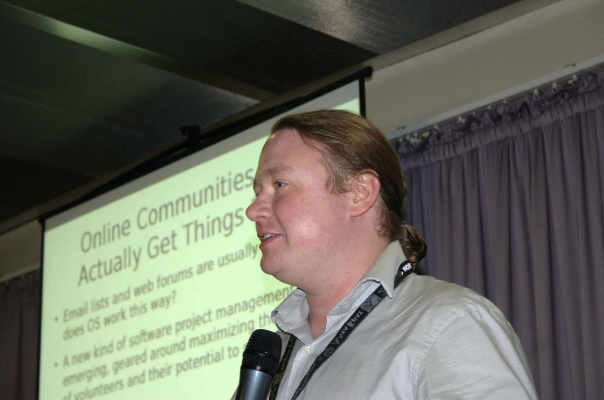
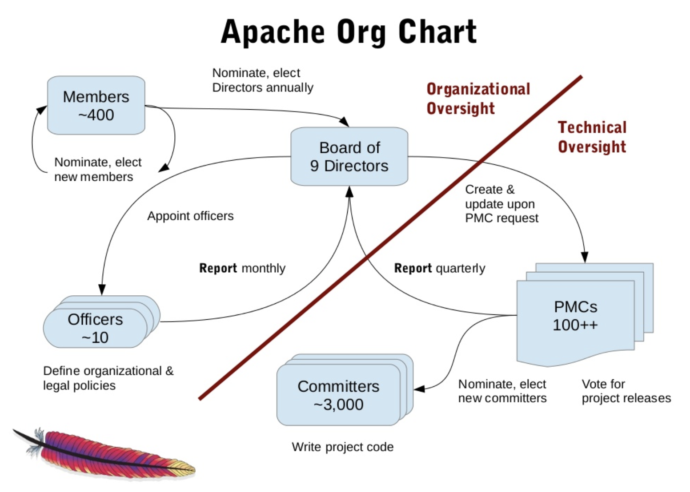

### 아파치소프트웨어재단
아파치소프트웨어재단(Apache Software Foundation, ASF)은 다양한 오픈소스 프로젝트를 지원하고 관리하는 비영리 재단이다.    
자유소프트웨어재단(Free Software Foundation, FSF)과 함께 오픈소스 문화를 꽃피운 대표 단체로 꼽힌다.    
ASF에서 관리하는 오픈소스 소프트웨어는 누구나 참여할 수 있는 동시에 '아파치 방식(Apache Way)'이라는 독특한 문화 아래에서 관리된다.   

### 아파치 웹서버에서 시작된 비영리 단체
ASF는 1999년 설립된 미국의 공식 비영리단체이다.    
ASF 설립에 참여한 이들은 1995년부터 1999년까지 '아파치 그룹'이란 이름으로 활동했으며, 당시 '아파치 HTTPD 웹서버'를 개발하는데에 힘쓰고 있었다.    
아파치 웹서버는 누구나 무료로 사용할 수 있고, 소스코드를 수정하고 재배포할 수 있는 서버였다.    
동시에 지속적인 유지보수도 필요했다.    당시 브라이언 벨렌도프라는 개발자는 보다 체계적으로 아파치 웹서버 기술을 개선하고자 메일링 리스트를 만들었고, 이후 많은 기여자가 협업하면서 아파치 웹서버 기술을 발전시켰다.   

ASF는 왜 하필 '아파치'라는 이름을 사용했을까? 아파치는 미국의 인디언 부족명에서 따왔다고 한다.   
아파치 부족은 용맹한 전사를 거느리고 다양한 전략을 구상하는 종족으로 유명했으며, 19세기 미국 군대와 직접 전투를 벌이기도 했다.   
또한 '패치 웨버서(patchy web server)'라는 발음과 비슷한 점도 아파치라는 이름을 선택하는 데 영향을 끼쳤다. 패치는 어떤 프로그램을 일부 수정하는 작업을 뜻한다.

아파치 서버는 향후 전세계 웹사이트 중 65%가 사용할 만큼 인기 있는 기술이 됐다. 아파치 그룹은 이외에도 자바, 펄, PHP와 관련된 다양한 오픈소스 프로젝트를 진행했다. 다양한 기술을 만들었던 개발자들은 법률적인 조언이나 경제적인 지원을 해줄 수 있는 체계적인 단체가 필요하다고 느꼈고, 그에 따라 ASF가 설립됐다.

ASF는 오픈소스 기여자들이 소프트웨어 개발에 집중하도록 도와주고 있다. 예를 들어 ASF는 오픈소스 개발에 필요한 하드웨어를 제공하거나 커뮤니케이션을 보다 쉽게 할 수 있게 지원한다. 개인들이 지적재산권 분쟁 같은 소송에 휘말리지 않도록 법적인 보호막도 제공한다. 다른 단체에서 '아파치'라는 브랜드를 함부로 사용하지 못하도록 막는 역할도 맡고 있다.   

### 독특한 조직 문화, '아파치 방식'

ASF에서 만드는 소프트웨어는 리눅스나 파이썬처럼 특정 한 사람을 중심으로 개발되지 않는다. 같은 관심을 가진 그룹이 모여 정보를 공유하며 집단으로 개발한다. ASF가 제공하는 오픈소스 프로젝트들은 '아파치 라이센스'로 배포된다. 아파치 라이선스는 다른 오픈소스 라이선스 보다 자유도가 높은 편이다.

