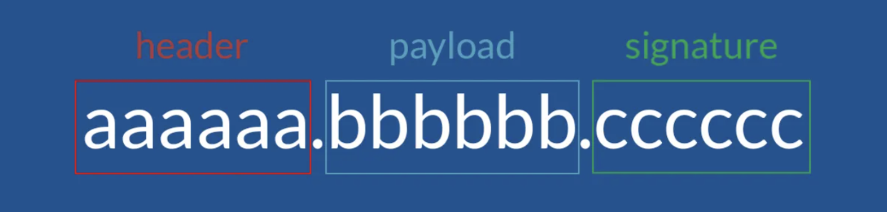
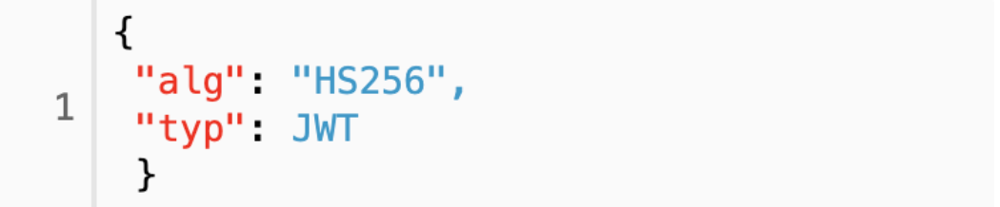

# JWT (JSON Web Token)
- JWT(Json Web Token)은 선택적 서명 및 선택적 암호화를 사용하여 데이터를 만들기 위한 인터넷 표준으로, 페이로드는 몇몇 클레임 표명을 처리하는 JSON을 보관하고 있다. 토큰은 비공개 시크릿 키 또는 공개/비공개 키를 사용하여 서명된다.
### JWT의 구성

1. Header는 토큰의 타입과 해시 암호화 알고리즘으로 구성되어있다. 첫째는 토큰의 유형 (JWT)을 나타내고, 두 번째는 HMAC, SHA256 또는 RSA와 같은 해시 알고리즘을 나타내는 부분이다.
    - HEADER(헤더) 토큰의 헤더는 typ과 alg 두 가지 정보로 구성된다. alg는 헤더(Header)를 암호화 하는 것이 아니고, Signature를 해싱하기 위한 알고리즘을 지정하는 것이다.
      - typ : 토큰의 타입을 지정 ex) JWT
      - alg : 알고리즘 방식을 지정하며, 서명(Signature) 및 토큰 검증에 사용   
ex) HS256(SHA256) 또는 RSA

