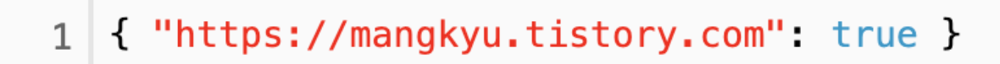

# JWT (JSON Web Token)
- JWT(Json Web Token)은 선택적 서명 및 선택적 암호화를 사용하여 데이터를 만들기 위한 인터넷 표준으로, 페이로드는 몇몇 클레임 표명을 처리하는 JSON을 보관하고 있다. 토큰은 비공개 시크릿 키 또는 공개/비공개 키를 사용하여 서명된다.
### JWT의 구성

1. Header는 토큰의 타입과 해시 암호화 알고리즘으로 구성되어있다. 첫째는 토큰의 유형 (JWT)을 나타내고, 두 번째는 HMAC, SHA256 또는 RSA와 같은 해시 알고리즘을 나타내는 부분이다.   

- **HEADER(헤더)** 토큰의 헤더는 typ과 alg 두 가지 정보로 구성된다. alg는 헤더(Header)를 암호화 하는 것이 아니고, Signature를 해싱하기 위한 알고리즘을 지정하는 것이다.
    - typ : 토큰의 타입을 지정 ex) JWT
    - alg : 알고리즘 방식을 지정하며, 서명(Signature) 및 토큰 검증에 사용   
ex) HS256(SHA256) 또는 RSA


2. Payload는 토큰에 담을 클레임(claim) 정보를 포함하고 있습니다. Payload 에 담는 정보의 한 ‘조각’ 을 클레임이라고 부르고, 이는 name / value 의 한 쌍으로 이뤄져있습니다. 토큰에는 여러개의 클레임 들을 넣을 수 있습니다. 클레임의 정보는 등록된 (registered) 클레임, 공개 (public) 클레임, 비공개 (private) 클레임으로 세 종류가 있습니다.   
  - 토큰의 페이로드에는 토큰에서 사용할 정보의 조각들인 클레임(Claim)이 담겨 있다. 클레임은 총 3가지로 나누어지며, Json(Key/Value) 형태로 다수의 정보를 넣을 수 있다.   


  2.1 등록된 클레임(Registered Claim)   
  등록된 클레임은 토큰 정보를 표현하기 위해 이미 정해진 종류의 데이터들로, 모두 선택적으로 작성이 가능하며 사용할 것을 권장한다. 또한 JWT를 간결하게 하기 위해 key는 모두 길이 3의 String이다. 여기서 subject로는 unique한 값을 사용하는데, 사용자 이메일을 주로 사용한다.   

```
iss: 토큰 발급자(issuer)

sub: 토큰 제목(subject)

aud: 토큰 대상자(audience)

exp: 토큰 만료 시간(expiration), NumericDate 형식으로 되어 있어야 함 ex) 1480849147370

nbf: 토큰 활성 날짜(not before), 이 날이 지나기 전의 토큰은 활성화되지 않음

iat: 토큰 발급 시간(issued at), 토큰 발급 이후의 경과 시간을 알 수 있음

jti: JWT 토큰 식별자(JWT ID), 중복 방지를 위해 사용하며, 일회용 토큰(Access Token) 등에 사용
```

  2.2 공개 클레임(Public Claim)   
  공개 클레임은 사용자 정의 클레임으로, 공개용 정보를 위해 사용된다. 충돌 방지를 위해 URI 포멧을 이용하여, 예시는 아래와 같다. 

  

  2.3 비공개 클레임(Private Claim)   
  비공개 클레임은 사용자 정의 클레임으로, 서버와 클라이언트 사이에 임의로 지정한 정보를 저장한다

  

  3. 마지막으로 Signature는 secret key를 포함하여 암호화되어 있다.   
    - 서명(Signature)은 토큰을 인코딩하거나 유효성검증을 할 때 사용하는 고유한 암호화 코드이다. 서명(Signature)은 위에서 만든 헤더(Header)와 페이로드(Payload)의 값을 각각 BASE64로 인코딩하고, 인코딩한 값을 비밀 키를 이용해 헤더(Header)에서 정의한 알고리즘으로 해싱을 하고, 이 값을 다시 BASE64로 인코딩하여 생성한다.