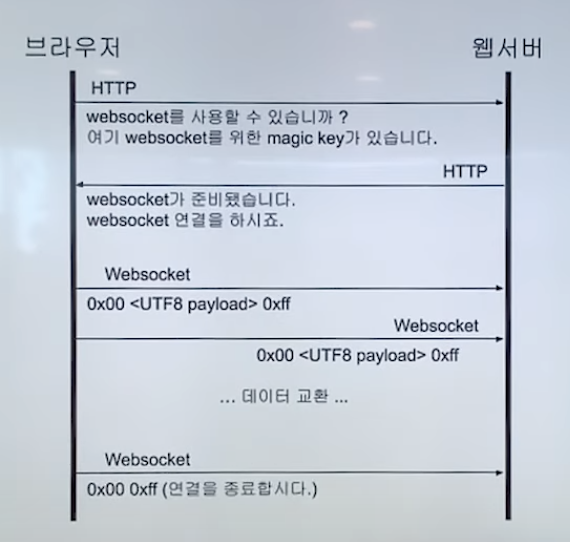

# 소켓(Socket) 통신 이란?


- 웹 소켓이란 두 프로그램 간의 **메세지를 교환하기 위한 통신 방법 중 하나**이다.

- 현재 인터넷 환경(HTML5) 에서 많이 사용된다.

- 웹 소켓을 지원하는 브라우저의 경우 **웹 소켓 프로토콜**을 지원 한다.

### 웹 소켓의 특징

1. 양방향 통신 (Full-Duplex)
- 데이터 송수신을 동시에 처리할 수 있는 통신 방법
- 클라이언트와 서버가 서로가 원할 때 데이터를 주고 받을 수 있다.
- **통상적인 Http 통신**은 Client가 요청을 보내는 경우에만 Server가 응답하는 **단방향 통신**

2. 실시간 네트워킹 (Real Time-Networking)
- 웹 환경에서 **연속된 데이터를 빠르게 노출**
- Ex ) 채팅, 주식, 비디오 데이터
- 여러 단말기에 빠르게 데이터를 교환

### 웹 소켓 동작 방법 - Hand Shaking
> 메인 헤더
```
GET /chat HTTP/1.1
Host: localhost:8080 
Upgrade: websocket 
Connection: Upgrade 
Sec-WebSocket-Key: x3JJHMbDL1EzLkh9GBhXDw== 
Sec-WebSocket-Protocol: chat, superchat 
Sec-WebSocket-Version: 13 
Origin: http://localhost:9000
```
- Upgrade : 프로토콜을 전환하기 위해 사용하는 헤더. 웹 소켓 요청 시에는 반드시 websocket이라는 값을 가지며, 이 값이 없거나 다른 값이면 cross-protocol attack 이라고 간주하며 웹 소켓 접속을 중지시킵니다.

- Connection : 현재의 전송이 완료된 후 네트워크 접속을 유지할 것인가에 대한 정보. 웹 소켓 요청 시에는 반드시 Upgrade 라는 값을 가지며, Upgrade와 마찬가지로 이 값이 없거나 다른 값이면 웹소켓 접속을 중지시킵니다.
- Sec-WebSocket-Key : 유효한 요청인지 확인하기 위해 사용하는 키 값.
- Sec-WebSocket-Protocol : 사용하고자 하는 하나 이상의 웹 소켓 프로토콜 지정. 필요한 경우에만 사용.
- Sec-WebSocket-Version : 클라이언트가 사용하고자 하는 웹소켓 프로토콜 버전. 현재 최신 버전 13
- Origin : 모든 브라우저는 보안을 위해 이 헤더를 보낸다(Cross-Stie WebSocket Hijacking와 같은 공격을 피해서). 대부분 어플리케이션은 이 헤더가 없는 요청을 거부하며, 이러한 이유로 CORS 정책이 만들어진 것입니다.

> 서브 헤더
```
- HTTP/1.1 101 Switching Protocols 
Upgrade: websocket 
Connection: Upgrade 
Sec-WebSocket-Accept: HSmrc0sMlYUkAGmm5OPpG2HaGWk= // 클라이언트에서 계산한 값과 일치하지 않으면 연결이 수립 X
Sec-WebSocket-Protocol: chat
```

### 웹 소켓의 간단 동작 방법



### 웹 소켓 프로토콜 특징
- 최초 접속에서만 http 프로토콜 위에서 handshaking을 하기 때문에 http header를 사용한다.
- 웹 소켓을 위한 별도의 포트는 없으며, 기존 포트 (http-80, https-443)을 사용
- 프레임으로 구성된 메세지라는 논리적 단위로 송수신
- 메시지에 포함될 수 있는 교환 가능한 메시지는 텍스트와 바이너리