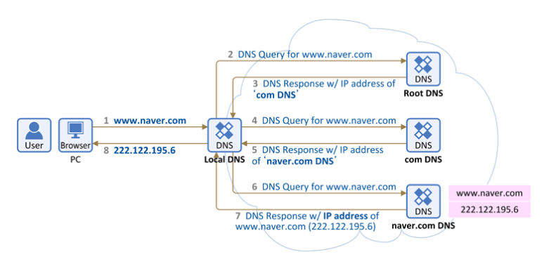

# 📫 DNS
> 도메인 네임 시스템(Domain Name System, DNS) 은 호스트의 도메인네임(www.example.com)을 네트워크주소(192.168.1.0)로 변환하거나, 그 반대의 역학을 수행하는 시스템이다.

- ```DNS``` 시스템은 이름과 숫자 간의 ```매핑```을 관리하여 마치 전화번호부와 같은 기능을 한다.

- (매핑 : www.example.com == 192.168.1.0, www.example.com == 192.168.1.5, ~~~~)

- ```DNS``` 서버는 사용자가 도메인 이름을 브라우저에 입력하면, 사용자를 어떤 서버에 연결할 것인지 제어한다. 이러한 요청을 ```쿼리``` 라고한다.

## DNS 서비스 유형

### 1. 신뢰할 수 있는 DNS
  - 개발자가 퍼블릭 DNS 이름을 관리하는 데 사용하는 업데이트 메커니즘을 제공한다.
  - 이를 통해 DNS 쿼리에 응답하여 도메인 이름을 IP주소로 변환한다.
  - 신뢰할 수 있는 DNS는 도메인에 대해 최종 권한이 있다.
  - 재귀적 DNS서버에 IP 주소 정보가 담긴 답을 제공할 책임이 있다.

### 2. 재귀적 DNS
- 보통 클라이언트는 신뢰할 수 있는 DNS 서비스에 직접 쿼리를 수행하지 않는다.
- ```해석기``` 또는 ```재귀적 DNS``` 서비스라고 알려진 다른 유형의 DNS 서비스에 연결하는 경우가 일반적이다.
- DNS 레코드를 소유하고 있지 않지만 사용자를 대신해서 DNS 정보를 가져올 수 있는 중간자의 역할을 한다.
- 일정 기간 동안 캐시된 또는 저장된 DNS 레퍼런스를 가지고 있는 경우, 소스 또는 IP정보를 제공하여 DNS 쿼리에 답을 하거나, 해당 정보를 찾기 위해 쿼리를 하나 이상의 신뢰할 수 있는 DNS에 전달한다.


## DNS 동작 원리


1. 위의 그림과 같이 PC 브라우저에서 www.naver.com 을 입력한다. 그러면 PC는 미리 설정되어 있는 DNS(단말에 설정되어 있는 이 DNS를 Local DNS라 부름, 위에서는 203.248.252.2) 에게 "www.naver.com 이라는 hostname" 에 대한 IP주소를 요청한다.

2. ```Local DNS``` 에는 "www.naver.com 의 IP주소" 가 있을 수도 없을 수도 있다. 만약 있다면 Local DNS 가 바로 PC에 IP주소를 주고 끝난다. 하지만 본 설명에서는 **Local DNS에 "www.naver.com 의 IP주소"가 없다고 가정** 한다.

3. Local DNS는 이제 "www.naver.com 의 IP주소"를 찾아내기 위해 **다른 DNS 서버들과 통신(DNS 메시지)을 시작**한다. 먼저 ```Root DNS``` 서버에게 "www.naver.com의 IP주소"를 요청하며, 이를 위해 각 Local DNS 서버에는 Root DNS 서버의 정보 (IP 주소)가 미리 설정되어 있어야 한다. ```Root DNS 서버``` 는 전세계에 13대가 구축되어있다.

4. **Root DNS 서버**는 "www.naver.com"를 찾을 수 없어 **Local DNS 서버**에게 "www.naver.com" 에 매핑되는 IP주소를 찾을 수 없으므로 다른 DNS서버에게 요청" 이라고 응답을 한다.

5. 이 다른 DNS 서버는 ```com 도메인``` 을 관리하는 DNS 서버이다.

6. 이제 **Local DNS 서버**는 **com 도메인을 관리하는 DNS 서버**에 다시 www.naver.com에 대한 IP 주소를 요청한다.

7. **com 도메인을 관리하는 DNS서버**에도 해당 정보가 없으면, Local DNS 서버에게 "www.naver.com 에 매핑하는 IP주소를 찾을 수 없으므로 다른 DNS 서버에게 요청" 이라고 응답을 한다. 이 다른 DNS 서버는 ```naver.com 도메인을 관리하는 DNS 서버``` 이다. 

8. 이제 **Local DNS 서버**는 **naver.com DNS 서버**에게 다시 "www.naver.com 의 IP 주소"를 요청한다.

9. **naver.com DNS 서버**에는 "www.naver.com의 IP 주소"가 있다. 그래서 **Local DNS 서버**에게 "www.naver.com에 대한 IP주소는 222.122.195.6"라는 응답을 한다.

10. 이를 수신한 **Local DNS**는 www.naver.com 의 IP주소를 캐싱을 하고 이후 다른 요청이 있을시 응답할 수 있도록 IP 주소 정보를 단말(PC)에 전달해 줍니다.

> Local DNS 서버가 여러 DNS 서버에 차례대로 (Root DNS 서버 -> com DNS 서버 -> naver.com DNS 서버) 요청하여 그 답을 찾는 과정을 ```Recursive Query``` 라고 부른다.

