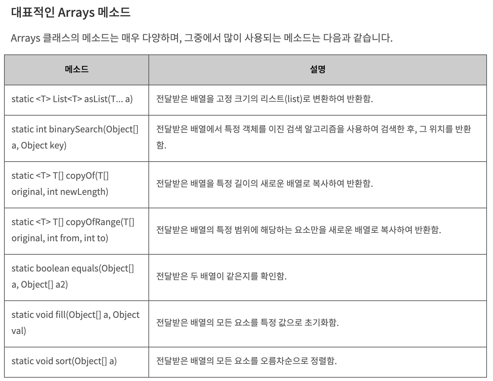

# Arrays 클래스
### java.util 패키지
- **java.util 패키지에는 프로그램을 개발하는데 사용할 수 있는 유용한 유틸리티 클래스가 다수 포함 되어 있다.**
- 하지만 import 문을 사용하지 않아도 바로 사용할 수 있는 java.lang 패키지와는 달리 **java.util 패키지는 import 문으로 패키지를 불러오고 나서야 클래스 이름만으로 사용할 수 있다.**

### java.util.Arrays 클래스
- Arrays 클래스에는 **배열을 다루기 위한** 다양한 메소드가 포함되어 있다.
- Arrays 클래스의 모든 메소드는 클래스 메소드(static method)이므로, 객체를 생성하지 않고도 바로 사용할 수 있다.
- 이 클래스는 java.util 패키지에 포함되므로, 반드시 import 문으로 java.util 패키지를 불러오고 나서 사용해야한다.

---
Arrays 메소드 모음 :   
https://kutar37.tistory.com/entry/%EC%9E%90%EB%B0%94-Arrays-%EB%A9%94%EC%86%8C%EB%93%9C

https://codedragon.tistory.com/8087