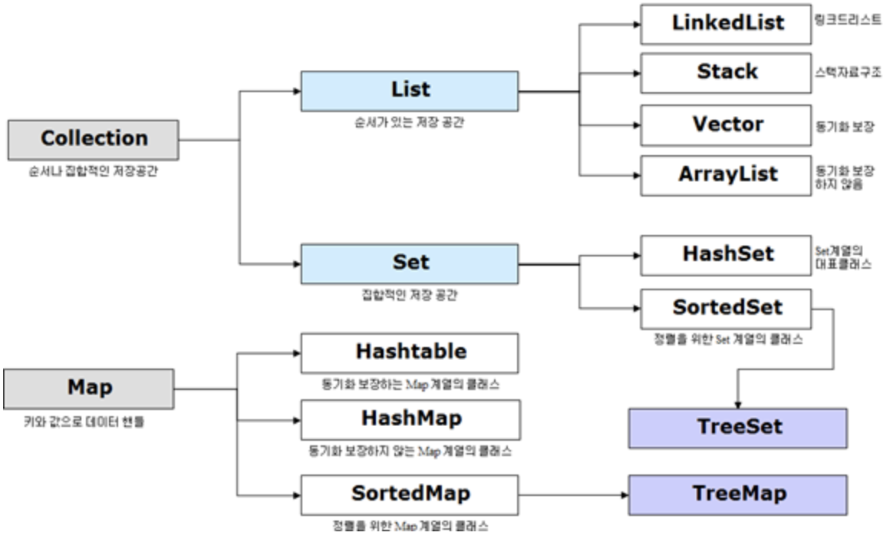

# Collection

- Java에서 **컬렉션(Collection)** 이란 데이터의 집합, 그룹을 의미한다.
- JCF(Java Collections Framework)는 이러한 데이터, 자료구조인 컬렉션과 이를 구현하는 클래스를 정의하는 인터페이스를 제공한다.

> 다음은 Java컬렉션 프레임워크의 상속구조를 나타낸다.


**1. Set 인터페이스**    
순서를 유지하지 않는 데이터의 집합으로 데이터의 중복을 허용하지 않는다.

- HashSet : 랜덤
- LinkedHashSet : 입력 순서대로
- TreeSet : comparator에 의해서 정렬됨   
(Comparator - 이 인터페이스를 구현한 클래스는 정렬 규칙 그 자체를 의미하며, 기본 정렬 규칙과 다르게 원하는대로 정렬순서를 지정하고 싶을 때 사용한다.)
```java
//1. HashSet 랜덤 정렬
Set<String> set1 = new HashSet<>();
set1.add("노경준");
set1.add("배태현");
set1.add("김태민");
System.out.println("HashSet_랜덤정렬_" + set1);

//2. LinkedHashSet 입력 순서대로 정렬
Set<String> set2 = new LinkedHashSet<>();
set2.add("노경준");
set2.add("배태현");
set2.add("김태민");
System.out.println("LinkedHashSet_입력 순서대로_"+ set2);

//3. TreeSet Compartor에 의해서
Set<String> set3 = new TreeSet<>(Comparator.reverseOrder());
set3.add("노경준");
set3.add("배태현");
set3.add("김태민");
System.out.println("TreeSet_Comparator_" + set3);
```

**2. List 인터페이스**   
순서가 있는 데이터의 집합으로 데이터의 중복을 허용한다.

- ArrayList : ArrayList는 **resizable-array(크기 조정이 가능한 배열)** 이다. 즉, **저장 용량이 자동으로 늘어난다**. 기본 생성자로 ArrayList 를 생성하면 10개의 객체 저장 용량을 갖는다. 물론, 처음부터 용량을 크게 잡을 수 있다.

```java
// ArrayList
List mylist = new ArrayList(100);
myList.add("노경준");
String name = (String)list.get(0);
// ArrayList는 Object타입으로 변환되어 저장되기 때문에, 모든 종류의 객체를 저장할 수 있다. 
// 하지만, 저장 및 조회할 때 Object로 변환 해야 하므로 성능이 좋지는 않다. 이런 단점을 보완한 것이 바로 제네릭이다.

// ArrayList + Generic
List<String> myList = new ArrayList<String>(); // 저장할때부터 String으로 지정
myList.add("노경준");
String name = list.get(0);
```

**3. Map**   
Map은 Key 와 Value 로 구성된 객체를 저장한다. 키는 중복 저장될 수 없다.

- HashMap : Key는 **중복될 수 없으며** null 값이 올 수 있다.
```java
// HashMap
HashMap<String,String> myHashMap = new HashMap<>();
myHashMap.put("1","노경준1");
myHashMap.put("2","노경준2");
myHashMap.put("3","노경준3");
System.out.println(myHashMap.get("3")); // 노경준3
```
