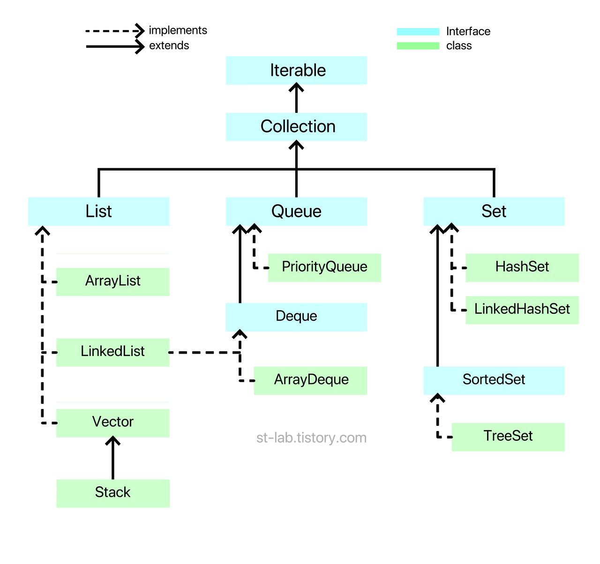
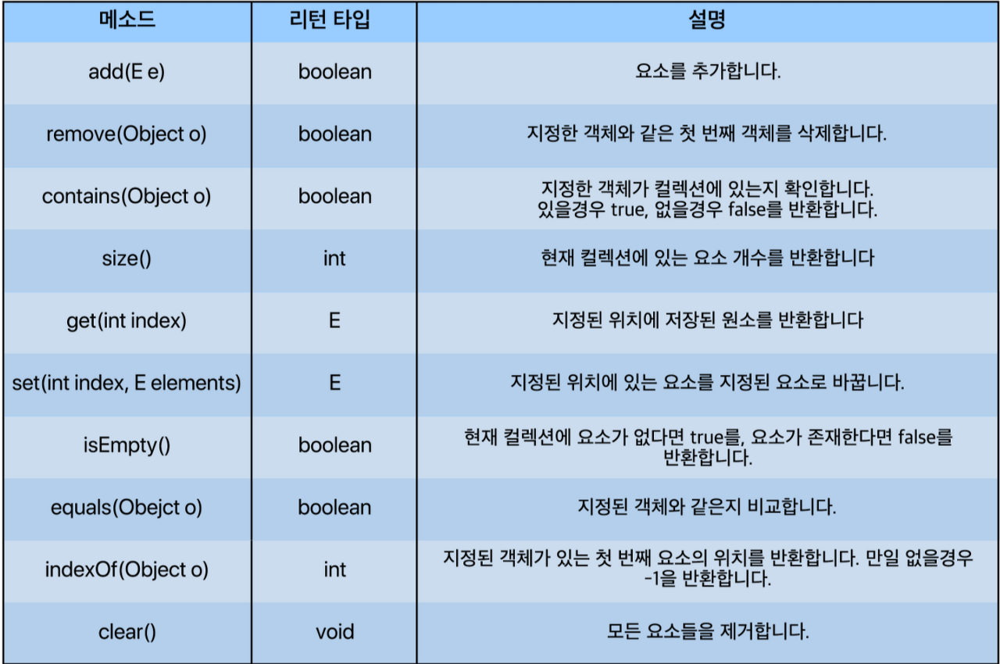
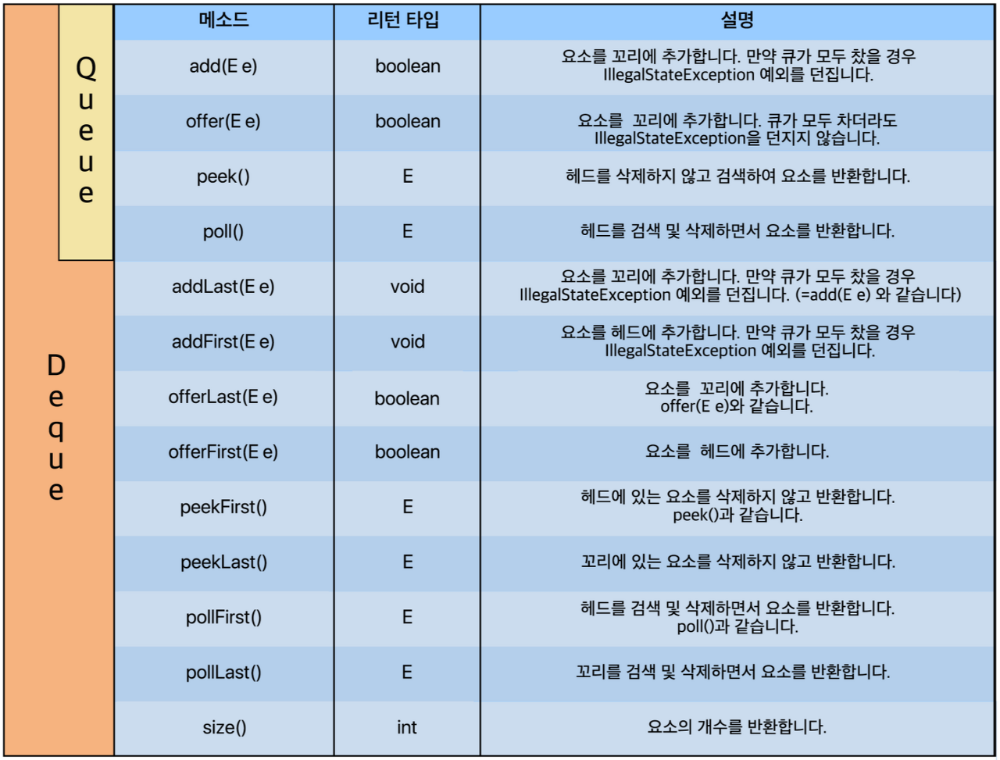
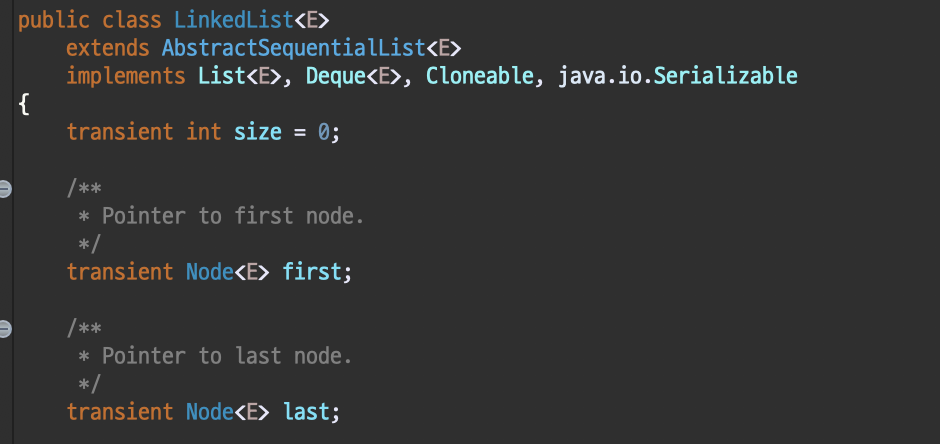
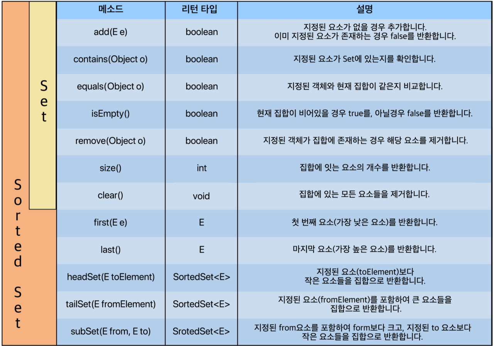

# Java Collections FrameWork

## 1. Java Collections FrameWork 가 무엇일까요?

##### Java Collections FrameWork의 의미는 Java에서 데이터들을 쉽게 다루기 위해 모아놓은 것들을 가공 및 처리할 수 있도록 지원하는 자료구조(뼈대가 되는 기본 구조)라는 뜻 입니다.

##### 기본 구조라고 한다면 Interface(인터페이스)가 떠오릅니다.

##### 인터페이스는 기본 뼈대(추상 구조)만 있습니다.<br> 이렇듯 실제로 자바에서 제공하는 Collection은 크게 3가지 인터페이스로 나뉘어 있습니다.

##### 크게 List(리스트), Queue(큐), Set(집합)으로 나뉘어 있습니다. <br> 앞서 설명한 "자료구조 분류" 라고 보면 됩니다. <br>그리고 분야별로 "구현" 된 것들이 있습니다.

##### 아래 이미지를 보시면 이해할 수 있습니다.



> ##### 점선은 구현(implements)이고, 실선은 확장(extends) 입니다.

##### List, Queue, Set 이 3가지의 형태에 따른 자료구조들이 있습니다. <br>그리고 Queue와 Set에는 조금 더 구체화 되어 Deque와 SortedSet이라는 형태에 따른 자료구조가 있는 것입니다.<br>그리고 이 형태에 따른 자료구조들은 각각 "구현"이 되어 class로 제공됩니다.

##### 바로 녹색 부분이 "구현된 자료구조"라고 보면 됩니다.<br> 자바에서 Interface를 class파일에서 쓰면 보통 "구현한다"라고 합니다. 이러한 메커니즘에 기반하여 이해하면 될 것입니다.

<br>

<br>

<br>

## 2. Iterable이 무엇일까요? 그리고 왜 Collection Interface 상위에 Iterable이 있을까요?

##### 제가 아는 Iterable은 반복문을 제어할 때 사용하는 것으로 조금 알고 있습니다.

##### 저기서 제공하고 있는 class 들은 모두 객체형태로 내부 구현 또한 대개 Object[] 배열 형태가 아니라 각각의 객체를 갖고 움직입니다.<br> 그래서 객체의 데이터들을 모두 순회하면서 출력하려면 사용자들이 각각의 데이터 순회 방법을 알거나 <br>하나씩 get() 같은 메소드를 통해 데이터를 하나씩 꺼내와야 합니다.

##### Iterable에서는 for-each를 제공합니다. Iterable 인터페이스를 사용하는 클래스들은 for-each 문법을 사용함으로써 반복자로 구현되어 나오게 합니다.

> ##### 이제부터 Java Collections Framework 의 핵심인 List, Queue, Set 에 대해 설명하겠습니다.

<br>

<br>

<br>

## 3. List, Queue, Set

### 3-1. List

##### List Interface(리스트 인터페이스)는 대표적인 선형 자료구조로 주로 순서가 있는 데이터를 목록으로 이용할 수 있도록 만들어진 인터페이스 입니다. 

##### 좀 더 쉽게 얘기하자면  다음과 같은 배열을 선언한 경우 10개의 공간 외에는 더이상 사용하지 못합니다. <br>13번의 인덱스에 값을 할당하고 싶어도 할당된 크기(범위) 밖이기 때문에 IndexOutofBoundsException 이 발생합니다.
```java
int[] array = new int[10];

array[11] = 30; // IndexOutofBoundsException 발생!!
```

##### 이러한 단점을 보완하여 List를 통해 구현된 클래스들은 "동적 크기"를 가지며 배열처럼 사용할 수 있게 된다.

##### 간단히, 배열의 기능 + 동적 크기 할당이 합쳐져 있다.

<br>

- ##### List Interface를 구현하는 클래스
##### 1. ArrayList
##### 2. LinkedList
##### 3. Vector (+ Vector를 상속받은 Stack )

<br>

- ##### List Interface에 선언된 대표적인 메소드


<br>

> ##### 여기서 ArrayList, LinkedList, Vector 를 설명하지만 더 자세한 내용은 따로 정리할 것입니다.

<br>

### 3-1-1. ArrayList
##### Object[] 배열을 사용하면서 내부 구현을 통해 동적으로 관리를 한다. 우리가 흔히 쓰는 primitive 배열(ex int[])과 유사한 형태라고 보면 된다. 

- ##### 특징 : 최상위 타입인 Object 타입으로 배열을 생성하여 사용하기 때문에 요소 접근에서는 탁월한 성능을 보이나<br> 중간의 요소가 삽입, 삭제가 일어나는 경우 그 뒤의 요소들은 한 칸씩 밀어나야 하거나 당겨야 하기 때문에 <br>삽입, 삭제에는 비효율적인 모습을 보인다.

<br>

### 3-1-2. LinkedList

##### 데이터(item)와 주소로 이루어진 클래스로 만들어 서로 연결하는 방식이다. 데이터와 주소로 이루어진 클래스를 Node(노드)라고 하는데, 각 노드는 이전의 노드와 다음 노드를 연결하는 방식인 것이다.(이중 연결 리스트라고도 한다.) 즉, 객체끼리 연결한 방식이다.

- ##### 특징 : Object 타입으로 배열을 생성하는 것이 아닌 Node 객체를 이용하여 사용한다. <br>요소를 검색해야 할 경우 처음 노드부터 찾으려는 노드가 나올 때 까지 연결된 노드들을 모두 방문해야한다는 점에서 성능이 떨어지나<br> 해당 노드를 삭제, 삽입해야 하는 경우 노드의 링크를 끊거나 연결만 해주면 되기 때문에 삽입, 삭제에서 매우 좋은 효율을 보인다.

<br>

### 3-1-3. Vector

##### 자바를 배울때 그리 자주 보이지 않는 클래스인데, 기본적으로 ArrayList와 거의 같다고 보면 된다. Object[] 배열을 사용하여 요소 접근에서 빠른 성능을 보인다.

- ##### 특징 : Object 타입으로 배열을 생성하여 사용한다. Vector의 경우 항상 "동기화"를 지원한다. <br> ( 쉽게 말하면 여러 쓰레드가 동시에 데이터에 접근하려면 순차적으로 처리하도록 한다. )<br>그렇다보니 멀티 쓰레드에서는 안전하지만, 단일 쓰레드에서도 동기화를 하기 때문에 ArrayList에 비해 성능이 약간 느리다.

<br>

### 3-1-4. Stack

##### 우리가 흔히 아는 쌓아 올리는 것이다. 

- ##### 특징 : Vector 클래스를 상속받고 있고, java에서 지원하는 Stack 클래스의 메소드들도 뜯어보면 알겠지만,<br> 모두 Vector에 있는 메소드를 이용하여 구현되고 있어 크게 다를 것은 없다.

<br>

> ##### 리스트의 설명은 여기까지이며 각각의 객체 생성 방법은 아래와 같습니다.

<br>

### 리스트 클래스들의 객체 생성 방법
```java
/* 
T는 객체 타입을 의미하며 기본적으로
Integer, String, Double, Long 같은 Wrapper Class부터
사용자 정의 객체까지 가능하다.
ex) LinkedList<Integer> list = new LinkedList<>();
primitive type은 불가능하다.
*/
 
// 방법 1
ArrayList<T> arraylist = new ArrayList<>();
LinkedList<T> linkedlist = new LinkedList<>();
Vector<T> vector = new Vector<>();
Stack<T> stack = new Stack<>();
 
// 방법 2
List<T> arraylist = new ArrayList<>();
List<T> linkedlist = new LinkedList<>();
List<T> vector = new Vector<>();
List<T> stack = new Stack<>();
 
// Stack은 Vector를 상속하기 때문에 아래와 같이 생성할 수 있다.
Vector<T> stack = new Stack<>();
```

<br>

### 3-2. Queue

##### Queue Interface(큐 인터페이스)는 선형 자료구조로 주로 순서가 있는 데이터를 기반으로 "선입선출(FIFO)"을 위해 만들어진 인터페이스입니다. <br>흔히 Stack(스택)과 많이 비교를 하는 자료구조 입니다. 

##### Queue에 대해 간단히 말하자면 10, 20, 30, 40 순으로 데이터를 넣고, 데이터를 꺼낼 때(poll) 넣은 순서 그대로 10, 20, 30, 40이 나오는 구조라는 것입니다. <br>이 때 가장 앞쪽에 있는 위치를 head(헤드)라고 부르고, 가장 후위(뒤)에 있는 위치를 tail(꼬리)라고 부릅니다.<br> 예로들면, 놀이기구를 타기위해 줄서있는 모습을 상상하면 됩니다.

##### Collection 구조를 보면 알겠지만 Queue를 상속하고 있는 Deque(덱) 이라는 Interface도 있습니다. <br>둘 다 같은 부류이지만 Queue는 한쪽 방향으로만(단방향) 삽입 삭제가 가능한 반면<br> Deque는 Double ended Queue라는 의미로 양쪽에서 삽입삭제가 가능한 자료구조라 보면 됩니다. 

<br>

- ##### Queue/Deque Interface를 구현하는 클래스

    ##### 1. LinkedList
    ##### 2. ArrayDeque
    ##### 3. PriorityQueue

<br>

- ##### Queue/Deque Interface에 선언된 대표적인 메소드



##### 목록은 많아 보이지만 단순히 Deque는 양방향이기 때문에 헤드와 꼬리를 나누어 메소드가 더 생성 되었을 뿐이니 외울 것은 크게 없습니다.

<br>

> ##### 다시 Queue/Deque Interface 를 구현하는 클래스들을 보겠습니다.

<br>

### 3-2-1. LinkedList
##### 왜 여기서 LinkedList가 또 나와? 싶을 것이다.

##### 그림을 보면 알겠지만 LinkedList는 List(리스트)를 구현하기도 하지만, Deque(덱)도 구현합니다. <br> 그리고 Deque Interface는 Queue Interface를 상속받는다.

##### 이말은 즉슨, LinkedList는 사실상 3가지 용도로 쓸 수 있다는 것이다.

##### 1. List
##### 2. Deque
##### 3. Queue

##### 실제로도 LinkedList class를 보면 다음과 같이 List와 Deque를 모두 구현한다.



<br>

> ##### 그렇다면 왜 LinkedList class는 Queue를 구현할까요?

##### 앞서 List를 설명할때, ArrayList와 LinkedList의 차이점은 Object[] 배열로 관리하느냐, Node라는 객체를 연결하여 관리하느냐의 차이이다.

##### 마찬가지로 "Deque 또는 Queue를 LinkedList 처럼 Node 객체로 연결해서 관리하길 원한다면 LinkedList를 쓰면 됩니다." 원리 자체는 크게 다르지 않기 때문에 LinkedList 하나에 다중 인터페이스를 포함하고 있는 것이다.

<br>

> ##### Node 로 구현 된 Queue를 선언하는 방법
```java
Queue<T> queue = new LinkedList<>();
```

<br>

> ##### Node 로 구현 된 Deque를 선언하는 방법
```java
Deque<T> queue = new LinkedList<>();
```

<br>

### 3-2-2. ArrayDeque
##### 반대로 ArrayList 처럼 Object[] 배열로 구현되어 있는 것은 ArrayDeque 이다. 물론 LinkedList와 ArrayDeque 둘 다 Deque을 구현하고 있고, Deque은 Queue를 상속받기 때문에 Queue로도 쓰일 수 있다.

##### 만약 자바에서 지원하는 컬렉션에서 "일반적인 큐"를 사용하고자 한다면 LinkedList로 생성하여 Queue로 선언하면 된다. 

<br>

> ##### Object[] 로 구현 된 Deque를 선언하는 방법
```java
Deque<T> deque = new ArrayDeque<>();
```

<br>

> ##### Object[] 로 구현 된 Deque를 선언하는 방법
```java
Deque<T> queue = new ArrayDeque<>();
```

<br>

### 3-2-3. PriorityQueue
##### 단어 해석 그대로 "우선순위 큐" 이다. <br>LinkedList는 Queue로 사용할 수 있다고 했다. 다만 큐의 원리가 선입선출이라는 전제 아래 짜여있다. 하지만 PriorityQueue는 "데이터 우선순위"에 기반하여 우선순위가 높은 데이터가 먼저 나오는 원리다. 따로 정렬방식을 지정하지 않는다면 낮은 숫자가 높은 우선순위를 갖는다.

##### (PriorityQueue 클래스는 어려우니 나중에 설명하겠다.)

<br>

### 큐 클래스들의 객체 생성 방법

```java
/* 
T는 객체 타입을 의미하며 기본적으로
Integer, String, Double, Long 같은 Wrapper Class부터
사용자 정의 객체까지 가능하다.
단, primitive type은 불가능하다.
*/

// 방법 1
ArrayDeque<T> arraydeque = new ArrayDeque<>();
PriorityQueue<T> priorityqueue = new PriorityQueue<>();
 
Deque<T> arraydeque = new ArrayDeque<>();
Deque<T> linkedlistdeque = new LinkedList<>();

// 방법 2
Queue<T> arraydeque = new ArrayDeque<>();
Queue<T> linkedlistdeque = new LinkedList<>();
Queue<T> priorityqueue = new PriorityQueue<>();
```

<br>

### 3-3. Set

##### Set(셋 / 세트)는 말 그대로 "집합" 입니다.<br>Set의 가장 큰 특징이라 하면 크게 두 가지가 있습니다. <br>첫 번째로 "데이터를 중복해서 저장할 수 없음" 입니다. 두 번째는 "입력 순서대로의 저장 순서를 보장하지 않는다" 입니다. <br>(다만 LinkedHashSet은 Set임에도 불구하고 입력 순서대로의 저장순서를 보장하고 있습니다. 그러나 데이터를 중복해서 저장할 수 없는 것은 같습니다.)

##### 기본적으로 List계열은 index, Node로 관리하기 때문에 add()같은 메소드를 쓰면 순서대로 저장되었습니다.
##### Queue 계열 또한 우선순위 큐(PriorityQueue)를 제외하고는 기본적으로 입력한 순서대로 객체가 연결되어있습니다. 

##### 하지만 Set 같은 경우에는 일반적으로 입력받은 순서와 상관없이 데이터를 집합시키기 때문에 입력받은 순서를 보장할 수 없습니다.

<br>

- ##### Set/SortedSet Interface를 구현하는 클래스
    ##### 1. HashSet
    ##### 2. LinkedHashSet
    ##### 3. TreeSet

<br>

- ##### Set/Interface에 선언된 대표적인 메소드


##### Set Interface를 구현하는 클래스들은 앞서 말했듯이 HashSet, LinkedHashSet, TreeSet 이렇게 3가지가 있습니다. <br>좀더 구체적으로 말하자면 TreeSet은 Set Interface를 상속받은 SortedSet Interface를 구현하고 입니다.<br> 그리고 Set의 가장 큰 특징은 "중복되는 데이터를 넣지 못한다는 점"이고, LinkedHashSet를 제외하고 대부분 Set은 "입력 순서대로의 저장순서를 보장하지 않는다는 점"입니다.

### 3-3-1. HashSet

##### 가장 기본적인 Set 컬렉션의 클래스이다.

- ##### 특징 : 입력 순서를 보장하지 않고, 순서도 마찬가지로 보장되지 않는다.

##### 가장 쉽게 이해할 수 있는 예로는 게임에서 '닉네임'을 만든다거나 아이디를 생성할때 '중복확인'을 눌러 중복된 닉네임 또는 아이디인지 확인하는 이다.<br> 이는 데이터가 정렬되어있을 필요도 없고, 빠르게 중복되는 값인지만 찾으면 되기 때문에 유용한 방법이 될 수 있다.

##### 좀 더 상세하게 말하자면 hash에 의해 데이터의 위치를 특정시켜 해당 데이터를 빠르게 색인(search)할 수 있게 만든 것이다.<br> 즉, Hash 기능과 Set컬렉션이 합쳐진 것이 HashSet입니다. 그렇기 때문에 삽입, 삭제, 색인이 매우 빠른 컬렉션 중 하나이다.

<br>

### 3-3-2. LinkedHashSet

##### 이름에서 볼 수 있듯이 Link + Hash + Set 이 결합된 형태이다. <br>첫번째 요소부터 차례대로 출력하면 입력했던 순서대로 출력된다는 것이고 이는 순서를 보장한다는 의미이다.

##### 그렇다면 언제 사용할까요?

##### 중복은 허용하지 않으면서 순서를 보장받고 싶을때에 사용하면 된다.

<br>

### 3-3-3. TreeSet
##### HashSet과 마찬가지로 입력 순서대로 저장 순서를 보장하지 않으며 중복 데이터 또한 넣지 못한다. <br>다만 특별한 점이 있다면 중복되지 않으면서 특정 규칙에 의해 정렬된 형태의 집합을 쓰고 싶을 때 쓴다. <br> 정렬된 형태로 있다보니 특정 구간의 집합요소들을 탐색할 때 매우 유용하다.

##### (Tree 라는 자료구조 자체가 데이터를 일정 순서에 의해 정렬하는 구조다. 거기에 더해진 것이 바로 Set인 중복값 방지 자료구조인 것이다.)

##### 특징 : 입력 순서대로 저장 순서를 보장하지 않으면서 중복 데이터 또한 넣지 못한다. 특정 규칙에 의해 정렬된 형태의 집합을 쓰고 싶을때 사용한다.

<br>

### 셋 클래스들의 객체 생성 방법

```java
/* 
T는 객체 타입을 의미하며 기본적으로
Integer, String, Double, Long 같은 Wrapper Class부터
사용자 정의 객체까지 가능하다.
단, primitive type은 불가능하다.
*/
 
HashSet<T> hashset = new HashSet<>();
LinkedHashSet<T> linkedhashset = new LinkedHashSet<>();
TreeSet<T> treeset = new TreeSet<>();
 
SortedSet<T> treeset = new TreeSet<>();
 
Set<T> hashset = new HashSet<>();
Set<T> linkedhashset = new LinkedHashSet<>();
Set<T> treeset = new TreeSet<>();
```


<br>

<br>

<br>

## 4. 정리

##### 길고 긴 정리가 끝났습니다. 마지막으로 각 자료구조의 핵심들만 뽑아서 정리하겠습니다.

##### 1. List
  - ##### ArrayList : 최상위 타입인 Object 타입으로 배열을 생성하여 사용하기 때문에 요소 접근에서는 탁월한 성능을 보이나<br> 중간의 요소가 삽입, 삭제가 일어나는 경우 그 뒤의 요소들은 한 칸씩 밀어나야 하거나 당겨야 하기 때문에 <br>삽입, 삭제에는 비효율적인 모습을 보인다.
  
  - ##### LinkedList : Object 타입으로 배열을 생성하는 것이 아닌 Node 객체를 이용하여 사용한다. <br>요소를 검색해야 할 경우 처음 노드부터 찾으려는 노드가 나올 때 까지 연결된 노드들을 모두 방문해야한다는 점에서 성능이 떨어지나<br> 해당 노드를 삭제, 삽입해야 하는 경우 노드의 링크를 끊거나 연결만 해주면 되기 때문에 삽입, 삭제에서 매우 좋은 효율을 보인다.

  - ##### Vector : Object 타입으로 배열을 생성하여 사용한다. Vector의 경우 항상 "동기화"를 지원한다. <br> ( 쉽게 말하면 여러 쓰레드가 동시에 데이터에 접근하려면 순차적으로 처리하도록 한다. )<br>그렇다보니 멀티 쓰레드에서는 안전하지만, 단일 쓰레드에서도 동기화를 하기 때문에 ArrayList에 비해 성능이 약간 느리다.

  - ##### Stack : Vector 클래스를 상속받고 있고, java에서 지원하는 Stack 클래스의 메소드들도 뜯어보면 알겠지만,<br> 모두 Vector에 있는 메소드를 이용하여 구현되고 있어 크게 다를 것은 없다.

##### 2. Queue
  - ##### LinkedList : Deque 또는 Queue를 LinkedList 처럼 Node 객체로 연결해서 관리하길 원한다면 LinkedList를 쓰면 된다.
  
  - ##### ArrayDeque : Deque 또는 Queue를 Object 타입으로 배열을 생성하여 사용하길 원한다면 ArrayDeque 를 사용하면 된다.

  - ##### PriorityQueue : 단어 그대로 우선순위 큐로 "데이터 우선순위에 기반"하여 우선순위가 높은 데이터부터 먼저 나오는 원리 이다.<br>따로 정렬방식을 지정하지 않는다면 낮은 숫자가 높은 우선순위를 갖는다.

##### 3. Set
  - ##### HashSet : 입력 순서를 보장하지 않고, 순서도 마찬가지로 보장되지 않는다.
  - ##### LinkedHashSet : 중복은 허용하지 않으면서 순서를 보장받고 싶을때에 사용하면 된다.
  - ##### TreeSet : 입력 순서대로 저장 순서를 보장하지 않으면서 중복 데이터 또한 넣지 못한다. <br>특정 규칙에 의해 정렬된 형태의 집합을 쓰고 싶을때 사용한다.

<br>

<br>

<br>

## 5. 출처

###### 이 글은 st-lab 님의 블로그 자바 [JAVA] - 자바 컬렉션 프레임워크 (Java Collections Framework) 를 정리하여 만든 글 입니다. <br>제가 공부하기 쉽게 한 정리한 자료 이므로 자세한 내용은 아래 블로그에서 확인하실 수 있습니다.

###### https://st-lab.tistory.com/142?category=856997
