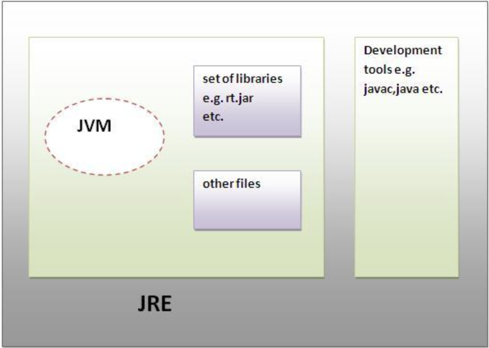

### JVM, JRE, JDK

### JVM
JVM은 **자바 가상머신(Java Runtime Environmetn)의 약자**이다.   
**JVM은 자바 소스코드로부터 만들어지는 자바 바이너리 파일(.class)을 실행할 수 있다.**   
또한 **JVM은 플랫폼에 의존적**이다.   
즉, 리눅스의 JVM과 윈도우즈의 JVM은 다르다.   
**하지만 컴파일된 바이너리 코드는 어떤 JVM에서도 동작**시킬 수 있다.   

JVM 은 다음과 같은 역할을 한다.
- 바이너리 코드 읽기
- 바이너리 코드 검증
- 바이너리 코드 실행
- 실행환경(Runtime Environment) 의 규격을 제공 (필요한 라이브러리 및 기타파일)

### JRE
JRE는 **자바 실행환경(Java Runtime Environment)의 약자**이다.

JRE는 **JVM 이 자바 프로그램을 동작시킬 때 필요한 라이브러리 파일들과 기타 파일**들을 가지고 있다.    
**JRE는 JVM의 실행환경을 구현**했다고 할 수 있다.

### JDK
JDK는 자바 개발도구(Java Development Kit)의 약자이다.   

JDK는 JRE + 개발을 위해 필요한 도구(javac,java 등)들을 포함한다.

### JVM, JRE, JDK 구조
