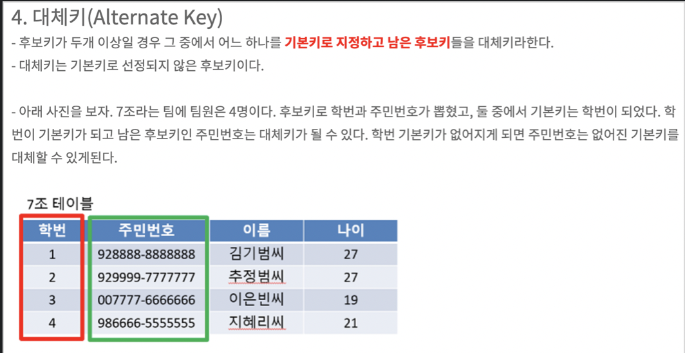

# Academy JPA 강의 [3강] - 필드와 컬럼 매핑
### 데이터베이스 스키마 자동 생성하기
* DDL을 애플리케이션 실행 시점에 자동 생성
* 테이블 중심 -> 객체 중심
* 데이터베이스 방언을 활용해서 데이터베이스에 맞는 적절한 DDL 생성
* 이렇게 생성된 *DDL은 개발 장비에서만 사용*
* 생성된 DDL은 운영서버에서는 사용하지 않거나, 적절히 다듬은 후 사용

*hibernate.hbm2ddl.auto*
* create : 기존테이블 삭제 후 다시 생성 (DROP + CREATE)
* create-drop : create와 같으나 종료시점에 테이블 DROP
* update : 변경분만 반영(운영DB에는 사용하면 안됨)
* validate : 엔티티와 테이블이 정상 매핑되었는지만 확인
* none : 사용하지 않음

### 데이터베이스 “스키마” 자동 생성하기 주의
* *운영장비에는 절대 create, create-drop, update 사용하면 안된다.*
* 개발 초기 단계는 create 또는 update
* 테스트 서버는 update 또는 validate
* 스테이징과 운영 서버는 validate 또는 none

### “매핑” 어노테이션
* @Column
```java
// member
@Column(name = "USERNAME", nullable = false)
private String name;
```
- 가장 많이 사용하는 어노테이션
- name 이 “USERNAME” 로 설정되어 DB에 “USERNAME” 있는 컬럼과 자바의 객체인 “name”과 매핑시켜준다.
- nullable 이 false라면 쿼리문에 not null 이 붙음
* @Enumerated
- 꼭 String으로 사용해야함

### 식별자 매핑 방법 ( 식별자 == 기본키 )
* @ ID(직접 매핑)

매핑은 솔직히 @Column, @Enumerated 정도가 대부분이다.
- IDENTITY : 데이터베이스에 위임, MYSQL
- SEQUENCE : 데이터베이스 시퀀스 오브젝트 사용, ORACLE
	- @SequenceGenerator 필요
- TABLE : 키 생성용 테이블 사용, 모든 DB에서 사용
	- @TableGenerator 필요
- AUTO : 방언에 따라 자동 지정, 기본값

### 권장하는 식별자 전략
- 기본 키 제약 조건 : null 아님, 유일, 변하면 안된다.
- 미래까지 이 조건을 만족하는 키를 찾기 어렵다. 대체키를 사용하자.
- 예를 들어 주민등록번호도 기본 키로 적절하기 않다.
- *권장 : Long + 대체키 + 키 생성전략 사용 (int형은 사용 X)*



