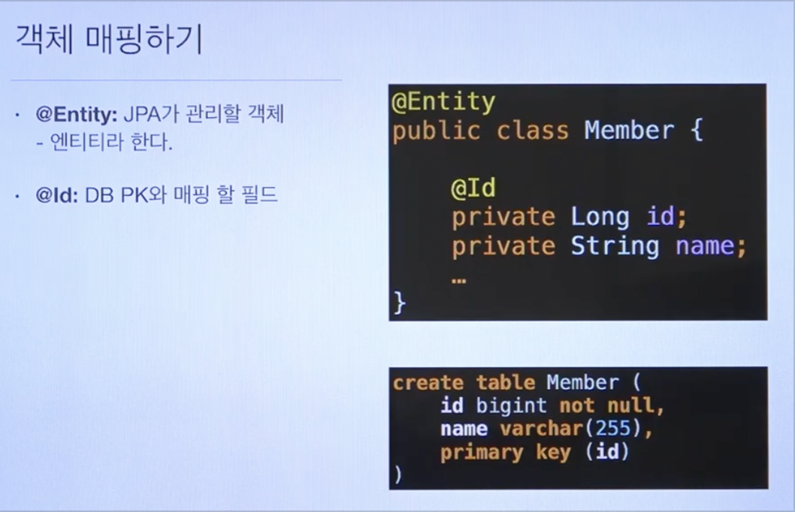

# Academy JPA 강의 [2강]
### 객체 매핑하기

### persistence.xml

- JPA를 사용하려면 위 파일이 꼭 필요하다.    
- EX)   

> (궁금점, 하이버네이트란?)
> Hibernate ORM은 자바 언어를 위한 객체 관계 매핑 프레임워크
> 간단히 말해 관계형 디비 테이브을 자바 객체로 맵핑 시켜 사용하겠다는 것
> 사용하는데에 여러가지 이유가 있다
>    - 디비 종류 변경시 대응
>    - 쿼리 결과를 자바. 객체로 바로 매핑되어 사용하기 편하기 때문
> JPA 안에있는 내용이 하이버네이트라 생각하면됨.

## 데이터베이스 방언
( <!—- 필수 속성 —-!> 아래에 있는 org.hibernate.dialect.H2Dialect 는 방언을 뜻한다. )
- JPA는 특정 데이터베이스에 종속적이지 않는 기술
- 각각의 데이터베이스가 제공하는 SQL 문법과 함수는 조금씩 다르다
	- 가변 문자 : MySQL은 VARCHAR, Oracle은 VARCHAR2
	- 문자열을 자르는 함수 : SQL 표준은 SUBSTRING(), Oracle은 SUBSTR()
	- 페이징 : MySQL은 LIMIT, Oracle은 ROWNUM
- 방언 : SQL 표준을 지키지 않거나 특정 데이터베이스만의 고유한 기능
( 한줄 정리 : SQL마다의 고유의 쿼리문이 다르기때문에 사용하는 SQL마다   org.hibernate.dialect.” ” << 이부분이 달라진다 )

- hibernate.dialect 속성에 지정
	- H2 : org.hibernate.dialect.H2dialect
	- Oracle 10g : org.hibernate.dialect.Oracle10gDialect
	- MySQL : org.hibernate.dialect.MySQL5lnnoDBDialect

- 하이버네이트는 45가지 방언 지원
