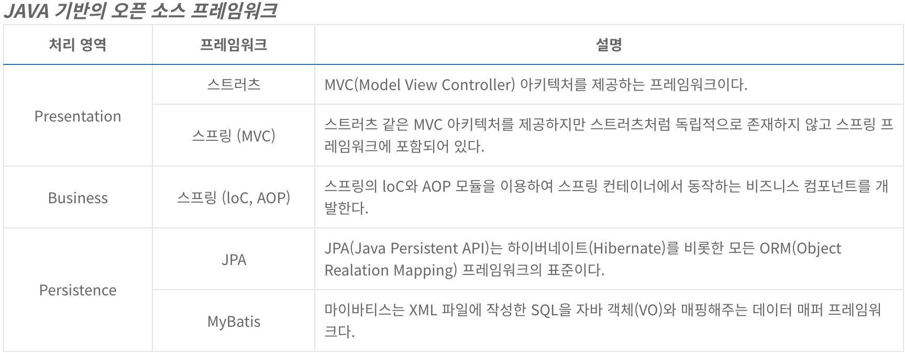

# Spring boot 를 사용하는 이유

### Framework
- 사전적인 의미는 '뼈대' 혹은 '구조' 이다.
- 소프트웨어 관점에서 해석하면, 프레임워크는 애플리케이션의 아키텍처에 해당하는 골격 코드라고 할 수 있다.
- 애플리케이션을 개발할 때 가장 중요한 것이 애프리케이션 전체 구조를 결정하는 **아키텍처** 이다. 
- 아키텍처에 해당하는 코드를 직접 개발하는 것이 아니라 프레임워크로부터 빌려 쓰면, 개발자는 아키텍처와 결합할 **비즈니스 로직 개발에만 집중**할 수 있게 된다.

### Spring Framework
- **EJB(Enterprise Java Bean)** 라는 무겁고 복잡한 플랫폼에서 벗어나 POJO(Plain Old Java Object)를 기반으로 하는 경량의 환경을 제공한다.
- 스프링 프레임워크가 처음 등장했을 때는 단순히 애플리케이션 운용에 필요한 객체들을 생성하고, **객체들 사이에서 의존성을 주입**해주는 단순한 컨테이너로서의 기능만 제공했지만 발전을 거듭한 현재의 스프링은 다양한 엔터프라이즈 시스템 개발에 필요한 모든 분야를 지원하는 하나의 플랫폼으로 자리잡았다.
- 하지만 다양한 프레임워크와 기술들을 지원하면서 동시에 개발자가 처리해야하는 설정도 많아지고 복잡해졌다.
- 복잡한 설정에서 발생한 문제들을 해결하려는 노력의 일환으로 '**스프링 부트**'라는 서브 프로젝트가 진행되었다.

### Spring Boot의 장점
### 1) 라이브러리 관리 자동화
- 기존 스프링 자바 프로젝트에서는 메이븐이나 그래들을 이용해서 라이브러리 의존성을 관리해왔다. 하지만 스프링부트에서는 **스타터(Starter)** 라는 것을 이용해 특정 기능에 필요한 라이브러리 의존성을 더욱 간단히 처리 할 수 있다.

### 2) 설정의 자동화
- 스프링 부트에서는 프로젝트에 추가된 라이브러리를 기반으로 실행에 필요한 환경을 **자동으로 설정**해준다.

### 3) 라이브러리 버전 자동 관리
- 라이브러리와 그 해당 라이브러리의 버전을 자동으로 관리해준다.

### 4) 테스트 환경과 내장 Tomcat
- **Junit**을 비롯한 테스트 관련 라이브러리들이 기본적으로 포함되어 있기 때문에 컨트롤러를 비롯한 다양한 계층의 클래스들에 대해서 **테스트 케이스를 쉽게 작성할 수 있다.**
- Tomcat 서버를 내장하고 있어서 main() 메소드를 가진 클래스를 실행하는 방식으로 서버를 구동하기 때문에 실행결과를 빠르게 확인할 수 있다.

### 5) 독립적으로 실행 가능한 JAR
- 애플리케이션을 개발하고 테스트까지 마쳤으면 애플리케이션을 실제 운영 서버에 배포하기 위해서 패키징을 해야하는데, 프로젝트가 일반 자바 프로젝트라면 간단하게 JAR파일로 패키징하면 되지만 웹 프로젝트라면 WAR 파일로 패키징 해야한다.
- 스프링 부트는 독립적으로 실행 가능한 애플리케이션을 빠르게 개발하는 것을 목표로 하기 때문에 **웹 애플리케이션도 WAR가 아닌 JAR파일로 패키징 하여 사용할 수 있다.**