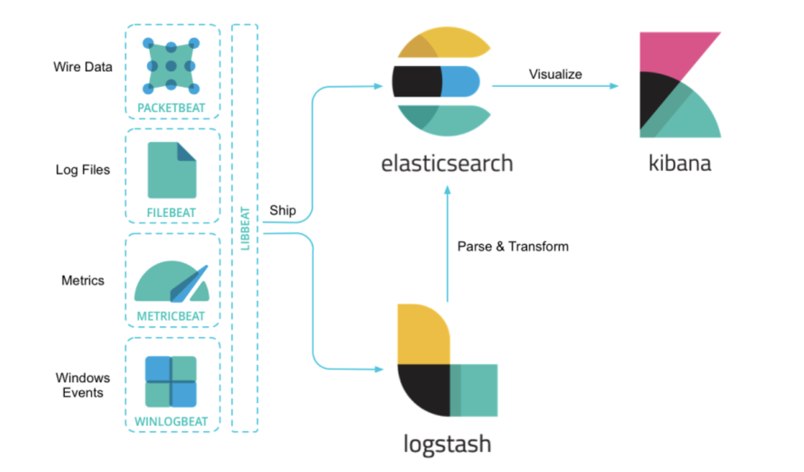

### ELK Stack 이란?
ELK는 `Elasticsearch`, `Logstash`,`Kibana` 세 가지 오픈소스 프로젝트의 이니셜 이다.

### Elasticsearch
Elasticsearch는 JSON 기반의 분산형 RESTful 검색 및 분석 엔진이다.   
Apache Lucene 기반으로 구축되었으며 분산형 및 개방형을 특징으로 한다.
Lucene이 Java로 만들어졌기 때문에 Elasticsearch 또한 Java로 개발되어 있다.

Elasticsearch의 가장 큰 장점은 실시간(real-time) 분석 시스템이라는 것이다.   
현재 대용량 데이터 분석에 가장 널리 사용되고 있는 하둡(Hadoop)은 배치 기반으로 `데이터수집->분석->결과도출` 루틴으로 실행된다.   
반면 Elasticsearch는 클러스터가 실행되고 있는 동안 계속해서 데이터가 입력(Indexing)되고, 그와 동시에 실시간에 가까운 속도로 색인된 데이터의 검색과 집계가 가능하다.   
이가 가능한 이유는 역인덱스(Inverted file index) 데이터 구조를 사용하여 풀텍스트(Full text) 검색을 할 수 있도록 설계되어있기 때문이다.   
역색인이란 전공서적 맨 뒷편의 색인된 키워드를 역으로 본문을 찾는 방식을 생각하면 된다.   

여담으로, Elasticsearch의 핵심 기능들은 Apache 2.0 라이센스로 배포되고 있으며, 6.3 버전부터는 Elastic 라이센스와 Apache 라이센스가 섞여있다. X-Pack 디렉토리 아래의 파일들이 Elastic EULA 라이센스가 적용되고 그 외의 파일은 Apache 라이센스를 따른다.   
최근 이를 두고 벌어지는 AWS 와 Elastic 사의 분쟁이 굉장한 이슈이다.   

( Elastic사에서 AWS를 막기 위해 라이센스를 변경했고, AWS는 Apache 2.0 라이센스의 Elasticsearch를 fork하여 직접 운영하겠다고 발표하였다.   
앞으로 Elastic과 AWS의 Elasticsearch(상표권은 사용 못하겠지만)가 어떤 행보를 보일지, 개발자 커뮤니티는 어떤 버전을 선택할지가 초미의 관심사이다. )

### Logstash
Logstash는 실시간 파이프라인 기능을 가진 오픈소스 데이터 수집 엔진이다.   
JRuby로 되어있으며, Ruby로 개발되어 Java Runtime 가상머신 위에서 돌아간다.   
원래는 Elasticsearch와 별개로 시작된 프로젝트였으나, Logstash에서 출력 API로 Elasticsearch를 지원하기 시작하면서 많은 사용자들이 Elasticsearch의 입력 수단으로 Logstash를 사용하면서 ELK로 통합되었다.   

Logstash는 Server-side 데이터 처리 파이프라인으로 다양한 소스에서 데이터를 수집하고 통합한다.   
또한 수집된 데이터를 정규화하여 Elasticsearch 등의 목적지로 전송하는 역할을 한다.   
거의 대부분의 이벤트를 수집하여 변환할 수 있으며 기본으로 제공되는 여러 코덱을 이용하여 수집(Ingestion) 프로세스를 한층 더 간소화할 수 있다.

### Kibana
Kibana는 Elasticsearch에 색인된 데이터를 검색하고, 시각화 하는 오픈소스 프론트엔드 서비스이다.   
Elasticsearch로부터 document, aggregation 집계 결과 등을 불러와 웹으로 시각화 한다.   
기본적으로 Discover, Visualize, Dashboard 메뉴와 다양한 App으로 구성되어 있으며, 플러그인을 통해 확장 가능하다.   

Discover는 Elasticsearch에 색인된 소스 데이터들의 검색을 위한 메뉴이다.   
Dashboard는 Visualize 메뉴에서 만들어진 시각화 도구(수집된 차트, 그래프, 메트릭, 검색 및 지도 등)들을 조합하여 단일 페이지에 모아 놓고 다양한 관점에서 데이터에 요약된 인사이트를 제공한다.   

### ELK Stack 구성
기존에는 세 가지 오픈소스 제품을 통합하여 그냥 ELK 라고 하였으나, 2015년 Beats가 도입되여 ELK Stack 또는 Elastic Stack 이라는 서비스로 부르기 시작하였다.   
Beats란 서버에 에이전트로 설치하여 다양한 유형의 데이터를 Elasticsearch 또는 Logstash로 전송하는 오픈소스이다.   

경량 에이전트 Beats가 서버에 설치되어 데이터를 Logstash 또는 Elasticsearch로 전송한다.   
Logstash는 다양한 소스에서 데이터를 수집하고 가공, 변환하여 Elasticsearch에 인덱싱하여 전송한다.   
Elasticsearch는 수신된 데이터를 저장소에 저장하고, 탐색하는 역할을 수행한다.   
마지막으로 사용자는 Kibana를 통해 Elasicsearch에 저장된 데이터를 시각화하여 실시간 분석 등을 할 수 있다.