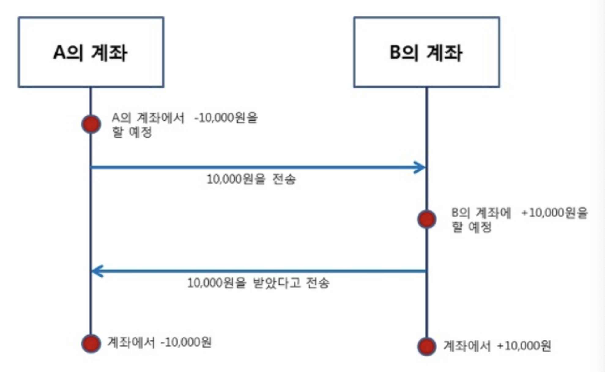
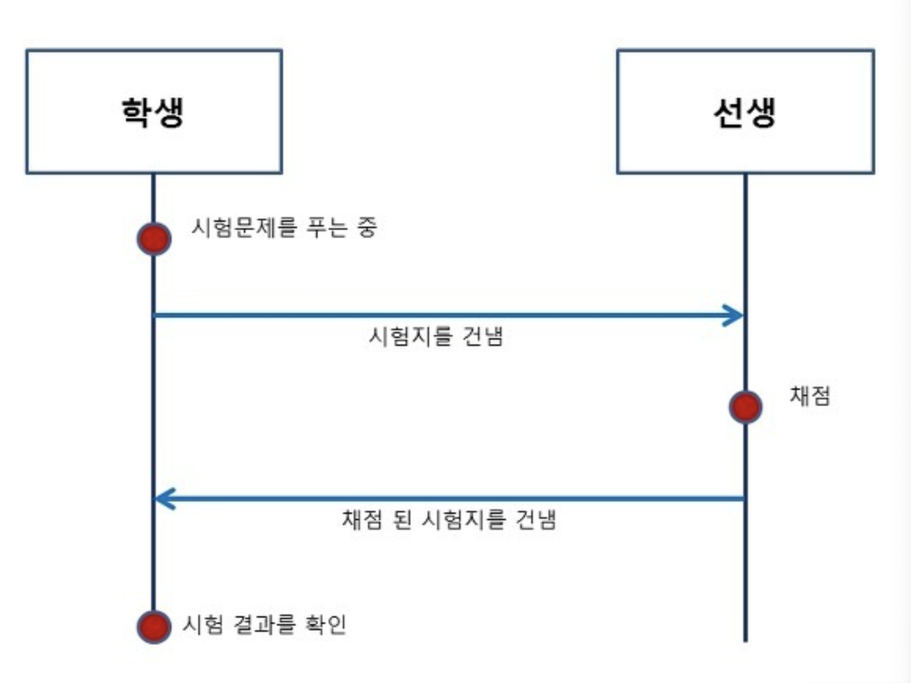

### 동기(Synchronous) 와 비동기(Asynchronous)

### 동기
동기는 말 그대로 **동시에 일어난다는 뜻**이다. 요청과 그 결과가 동시에 일어난다는 약속이다.
바로 요청을 하면 시간이 **얼마가 걸리던지 요청한 자리에서 결과가 주어져야 합니다.**

### 비동기
비동기는 동시에 일어나지 않는다를 의미한다. 요청과 결과가 동시에 일어나지 않을거라는 약속이다.

### 동기와 비동기의 차이
- 동기방식은 설계가 매우 간단하고 직관적이지만 결과가 주어질 때까지 아무것도 못하고 대기하야 하는 단점이 있다.
- 비동기방식은 동기보다 복잡하지만 결과가 주어지는데 시간이 걸리더라도 그 시간동안 다른 작업을 할 수 있으므로 자원을 효율적으로 사용할 수 있는 장점이 있다.

### 동기 처리방식의 예   
> 
> 1. A의 계좌는 B계좌에게 10,000 원을 송금할 예정이다.
> 2. A의 계좌가 B의 계좌로 10,000원을 송금한다.
> 3. 10,000원을 받은 B의 계좌는 A에게 10,000원을 받았음을 다시 알려준다.
> 4. A 는 10,000원을 차감 하고 B는 증가를 한다. ( 서로 요청과 응답을 확인한 후 같은 일을 동시에 진행함. )

### 비동기 처리방식의 예
>
> 1. 학생은 받은 시험지를 푼다.
> 2. 시험문제를 모두 푼 학생은 선생에게 자신이 푼 시험지를 건낸다.
> 3. 선생은 학생으로 부터 받은 시험지를 채점한다.( 비동기의 특징인 학생이 선생이 채점하기 전까지 기다리고 있어야함. )
> 4. 채점이 다 된 시험지를 학생에게 전송한다.   
> 5. 학생은 선생이 전송한 시험지를 받아 자신의 시험 결과를 확인한다.