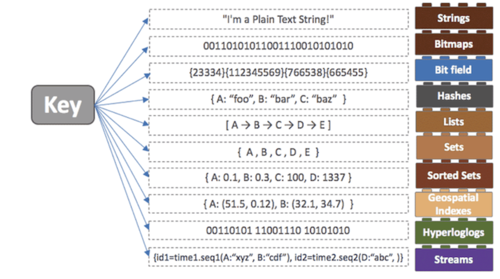

# Redis

Redis는 Memcached 와 비슷한 캐시 시스템으로서 동일한 기능을 제공하면서 **영속성, 다양한 데이터 구조와 같은 부가적인 기능을 지원**하고 있다.   
즉, `인메모리 데이터베이스` 이다.    
Redis는 빠른 성능으로 유명한데, 다른 인메모리 디비들과의 큰 차이점은 **다양한 자료구조**를 가지고있다.   



이렇게 다양한 자료구조를 지원하게 되면 **개발의 편의성이 좋아지고 난이도가 낮아진다는 장점**이 있다.   
왜냐하면 어떤 데이터를 정렬을 해야하는 상황이 있을때, DBMS를 이용한다면 DB에 데이터를 저장하고, **저장된 데이터를 정렬하여 다시 읽어오는 과정은 디스크에 직접 접근을 해야하기 때문에 시간이 더 걸린다는 단점**이 있다.    
하지만 Redis 에서 제공하는 `Sorted-Set` 이라는 자료구조를 사용하면 더 빠르고 간단하게 데이터를 정렬할 수 있다.  

### Redis 를 사용하는 이유
- **영속성**을 지원하는 인메모리 데이터 저장소
- 읽기 성능 증대를 위한 서버 측 복제를 지원
- 쓰기 성능 증대를 위한 클라이언트 측 **샤딩(Sharding)** 지원
- 다양한 서비스에서 사용되며 검증된 기술
- `문자열`, `리스트`, `해시`, `셋`, `정렬된 셋` 과 같은 다양한 데이터형을 지원.   
- 메모리 저장소임에도 불구하고 많은 데이터 형을 지원하므로 다양한 기능을 구현

한 문장으로 정리하자면 
```
레디스는 고성능 키-벨류 저장소로서 문자열, 리스트, 해시, 셋, 정렬된 셋 형식의 데이터를 지원하는 NoSQL 이다.
```
