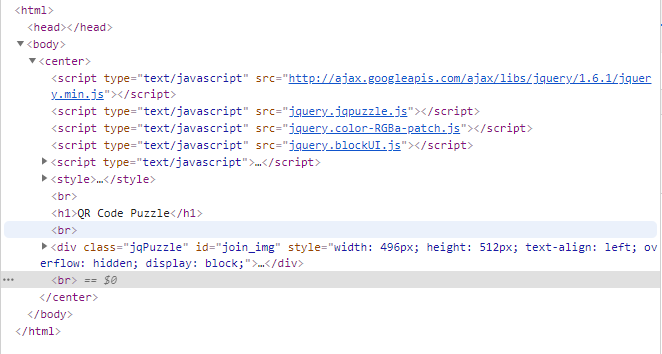

# Wargame.kr-QR_CODE_PUZZLE
## 1. F12(개발자도구)를 누르고   

## 2. qr코드에 해당하는 div 태그를 찾아서 \ 로 바꾼다.

## 3. 그렇다면 완성된 qr코드가 나올텐데 [온라인으로 qr코드를 인식하는 사이트](https://zxing.org/w/decode.jspx) 에 접속해서 사이트주소를 입력하면 flag code가 적힌 웹페이지가 나온다.