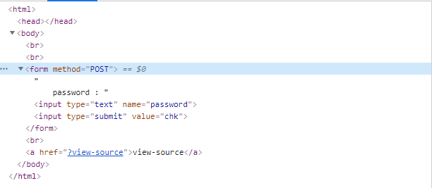

# Wargame.kr-7_Strcmp
## 1. 문제 페이지에 들어오면 view-sorce라는 링크가 담긴 문장이있다.

<br>

## 2. view-sroce 페이지 에는 
```
<?php
    require("../lib.php"); // for auth_code function
 
    $password = sha1(md5(rand().file_get_contents("/var/lib/dummy_file")).rand());
 
    if (isset($_GET['view-source'])) {
        show_source(__FILE__);
        exit();
    }else if(isset($_POST['password'])){
        sleep(1); // do not brute force!
        if (strcmp($_POST['password'], $password) == 0) {
            echo "Congratulations! Flag is <b>" . auth_code("strcmp") ."</b>";
            exit();
        } else {
            echo "Wrong password..";
        }
    }
 
?>
<br />
<br />
<form method="POST">
    password : <input type="text" name="password" /> <input type="submit" value="chk">
</form>
<br />
<a href="?view-source">view-source</a>

```

## 이러한 코드가 있다. 여기서 strcmp 함수는 두 문자열을 비교해서 같을 경우 0을 반환 하는데, 문자열과 배열을 비교하면 같지 않더라도 0을 출력하게 되는 취약점을 가지고 있다.

<br>

## 3. name="password" 의 password를 password[ ]로 바꾸고 아무 문자를 입력하면 된다.

